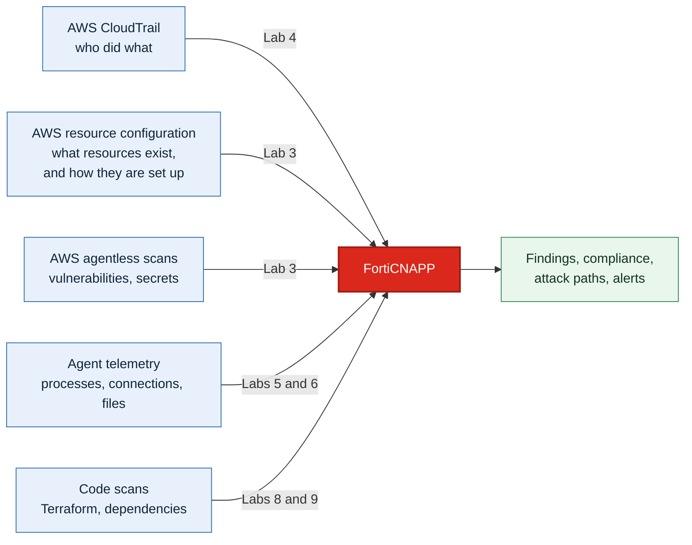

# FortiCNAPP Workshop: AWS Integration

Let's connect FortiCNAPP to an AWS account, then see what it finds!

## What FortiCNAPP is

Fortinet's cloud-native application protection platform, formerly Lacework. One platform
securing the whole code-to-cloud lifecycle, from the Terraform in a pull request to the
workload it becomes:

| | Answers |
|---|---|
| **Posture** | Is anything misconfigured, exposed, or failing a compliance framework? |
| **Workloads** | What is running on my hosts and containers, and is it behaving normally? |
| **Identities** | Who can do what in this account, and who actually does? |
| **Code security** | Would this have been a problem before it ever deployed? |

FortiCNAPP correlates across all four rather than alerting on each in isolation. That is
what lets it catch zero-day activity and compromised credentials from behaviour rather
than from a signature, while raising far fewer alerts.

The practical effect is fewer people chasing noise: cloud architects see what to fix and
in what order, risk teams get compliance evidence without asking for it, and threat teams
get a short list worth investigating.

## What you are building

## Hands-on lessons

| Lab | What you do | Why it matters |
|---|---|---|
| [1](lab-01/README.md) | Explore a populated console | See FortiCNAPP in action |
| [2](lab-02/README.md) | Get temporary AWS credentials | FortiCNAPP needs permission to build, briefly |
| [3](lab-03/README.md) | Onboard the account with the wizard | Configuration and agentless in one pass |
| [4](lab-04/README.md) | Add CloudTrail with CloudFormation | Threat detection, by a method the wizard cannot use here |
| [5](lab-05/README.md) | Install the Linux agent | Continuous visibility, not periodic snapshots |
| [6](lab-06/README.md) | Install the Windows agent | Same idea, different OS |
| [7](lab-07/README.md) | Install the Lacework CLI | Needed by Labs 8 and 9 |
| [8](lab-08/README.md) | Scan Terraform for misconfigurations | Catch it before it reaches AWS |
| [9](lab-09/README.md) | Scan an app for vulnerable dependencies | Catch them before they reach AWS |
| [10](lab-10/README.md) | Clean up | Leaving cloud resources running costs money |

## Optional: integrate AWS via infrastructure as code

Take these to onboard through a pipeline rather than a wizard.

| Lab | What you do | Why it matters |
|---|---|---|
| [11](lab-11/README.md) | Install Terraform | The wizard writes Terraform, so you need it to run the same thing yourself |
| [12](lab-12/README.md) | Onboard AWS via Terraform | Onboarding becomes reviewable code, not a set of console clicks |
| [13](lab-13/README.md) | Scripted cleanup | One script removes everything the workshop created |

## Short on time?

| You have | Run |
|---|---|
| 90 minutes | Labs 1 to 4, then 10 |
| Half a day | Labs 1 to 10 |

## Prerequisites

- An AWS account with administrator access
- FortiCNAPP console access, tenant **FORTINETAPACDEMO**
- A browser
- An RDP client for Lab 6: Remote Desktop Connection on Windows, **Windows App** on a Mac

## Resources

- <a href="https://docs.fortinet.com/product/forticnapp" target="_blank">FortiCNAPP documentation</a>
- <a href="https://docs.fortinet.com/document/forticnapp/latest/administration-guide/123850/automated-configuration" target="_blank">Automated configuration</a>

## Contributing

Questions or improvements, open an issue or a pull request.
