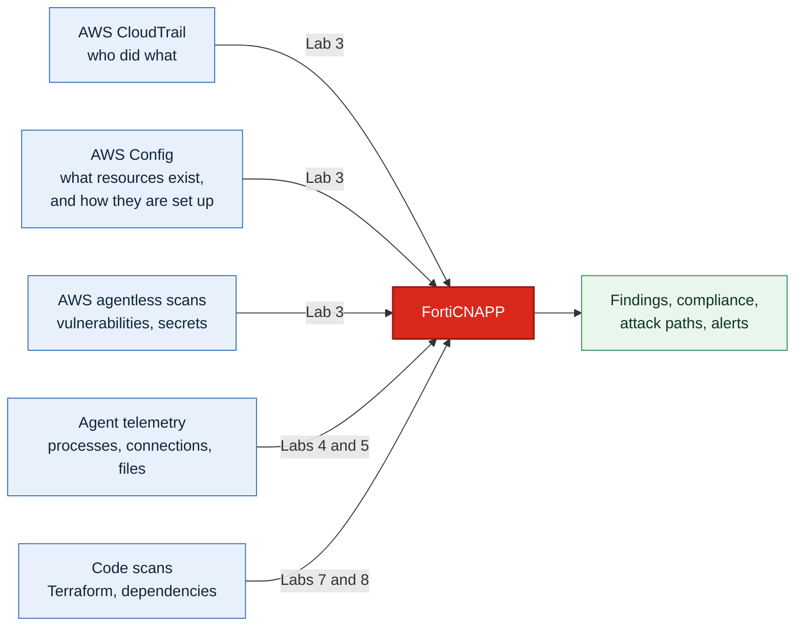

# FortiCNAPP Workshop: AWS Integration

Connect FortiCNAPP to an AWS account, then see what it finds. It runs in a browser and AWS
CloudShell, so there is nothing to install and nothing to clean up afterwards. Lab 5 also
uses an RDP client, which most machines already have.

Allow about three hours for Labs 1 to 9.

## What FortiCNAPP is

Fortinet's cloud-native application protection platform, formerly Lacework. One platform
covering what used to be four separate tools:

| | Answers |
|---|---|
| **Posture** | Is anything misconfigured, exposed, or failing a compliance framework? |
| **Workloads** | What is running on my hosts and containers, and is it behaving normally? |
| **Identities** | Who can do what in this account, and who actually does? |
| **Code security** | Would this have been a problem before it ever deployed? |

The value is in the join. A vulnerable package is a ticket. A vulnerable package, on a host
reachable from the internet, holding a credential with admin rights, is an incident waiting
to happen. Finding the second needs all four.

## What you are building

Five sources, one platform. Each lab explains its piece when you get there.

> Coming from the <a href="https://github.com/andrewbearsley/forticnapp-workshop-aws-integration" target="_blank">CloudFormation version of this workshop</a>?
> Labs 2 and 3 there become a single wizard here.

## Core path

| Lab | What you do | Why it matters |
|---|---|---|
| [1](lab-01/README.md) | Explore a populated console | See the destination before you build it |
| [2](lab-02/README.md) | Get temporary AWS credentials | FortiCNAPP needs permission to build, briefly |
| [3](lab-03/README.md) | Onboard the account | Config, CloudTrail and agentless in one pass |
| [4](lab-04/README.md) | Install the Linux agent | Continuous visibility, not periodic snapshots |
| [5](lab-05/README.md) | Install the Windows agent | Same idea, different OS |
| [6](lab-06/README.md) | Install the Lacework CLI | Needed by Labs 7 and 8 |
| [7](lab-07/README.md) | Scan Terraform for misconfiguration | Catch it before it reaches AWS |
| [8](lab-08/README.md) | Scan an app for vulnerable dependencies | Know your exposure when the next CVE lands |
| [9](lab-09/README.md) | Clean up | Leaving cloud resources running costs money |

## Optional: infrastructure as code

Take these when a customer wants onboarding through a pipeline rather than a wizard.

- [Lab 10: Install Terraform](lab-10/README.md)
- [Lab 11: Install Integrations via Terraform](lab-11/README.md)
- [Lab 12: Scripted Cleanup of All Workshop Resources](lab-12/README.md)

## Short on time?

| You have | Run |
|---|---|
| 90 minutes | Labs 1 to 3, then 9 |
| Half a day | Labs 1 to 9 |
| A developer audience | Labs 1 to 3, then 6 to 8. Labs 7 and 8 are the draw. |

## Prerequisites

- An AWS account you can afford to break, with administrator access
- FortiCNAPP console access, tenant **FORTINETAPACDEMO**
- A browser
- An RDP client for Lab 5: Remote Desktop Connection on Windows, **Windows App** on a Mac

## Resources

- <a href="https://docs.fortinet.com/product/forticnapp" target="_blank">FortiCNAPP documentation</a>
- <a href="https://docs.fortinet.com/document/forticnapp/latest/administration-guide/123850/automated-configuration" target="_blank">Automated configuration</a>

## Contributing

Questions or improvements, open an issue or a pull request.
