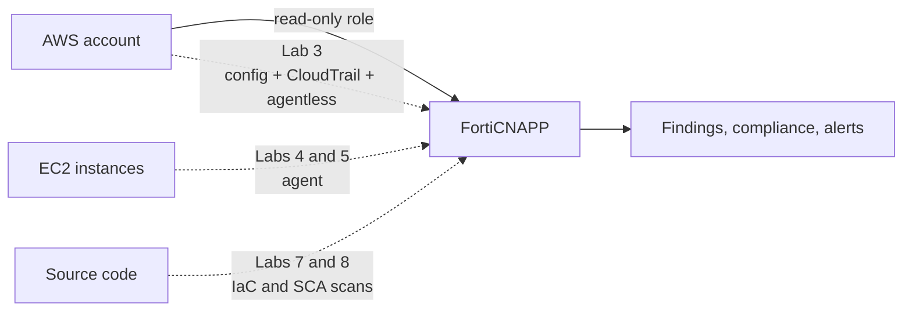

# FortiCNAPP Workshop: AWS Integration

Connect FortiCNAPP to an AWS account, then see what it finds. Everything runs in a browser
and AWS CloudShell. Nothing is installed on your laptop.

Allow about three hours for Labs 1 to 9.

## If you come from networking, start here

You already run the on-premises version of most of this. The names change, the job does not.

| You already do this | In the cloud it is called | Lab |
|---|---|---|
| Audit firewall rules and device configs against a standard | **Configuration assessment**, or CSPM | 3 |
| Collect syslog and NetFlow, alert on odd behaviour | **CloudTrail ingestion**, threat detection | 3 |
| Scan hosts for missing patches without touching them | **Agentless scanning**, snapshot based | 3 |
| Run an endpoint agent for live process and network visibility | **The FortiCNAPP agent** | 4, 5 |
| Review a config change before it goes to production | **IaC scanning** | 7 |
| Check firmware and library versions against CVE lists | **SCA**, software composition analysis | 8 |

One idea worth holding onto: in a data centre you control the hardware, so you monitor the
box. In the cloud there is no box you own. You monitor the **account** instead, by asking
the cloud provider what exists and what changed.

## What you are building

Three sources feed one platform. Labs 1 to 5 cover the cloud and the workloads. Labs 6 to 8
cover the code. Lab 9 takes it all away again.

## Three ways to connect an AWS account

FortiCNAPP gives you a choice. This workshop uses the first one.

| Method | How it works | Use it when |
|---|---|---|
| **Automated configuration** | You give FortiCNAPP short-lived credentials. It builds everything for you. | Default. Fastest, and what the console recommends. |
| CloudFormation | You launch a stack per integration and set the parameters yourself. | You want to read the template before anything is created. |
| Terraform | You take the code and run it yourself. | The customer wants onboarding in a pipeline, reviewed in a pull request. |

Same end state in all three. Automated configuration is the least typing, so the workshop
uses it and Labs 10 and 11 show the Terraform route for comparison.

> Coming from the <a href="https://github.com/andrewbearsley/forticnapp-workshop-aws-integration" target="_blank">CloudFormation version of this workshop</a>?
> Labs 2 and 3 there become a single wizard here.

## Core path

| Lab | What you do | Why it matters |
|---|---|---|
| [1](lab-01/README.md) | Explore a populated console | See the destination before you build it |
| [2](lab-02/README.md) | Get temporary AWS credentials | FortiCNAPP needs permission to build, briefly |
| [3](lab-03/README.md) | Onboard the account | Config, CloudTrail and agentless in one pass |
| [4](lab-04/README.md) | Install the Linux agent | Continuous visibility, not periodic snapshots |
| [5](lab-05/README.md) | Install the Windows agent | Same idea, different OS |
| [6](lab-06/README.md) | Install the Lacework CLI | Needed by Labs 7 and 8 |
| [7](lab-07/README.md) | Scan Terraform for misconfiguration | Catch it before it reaches AWS |
| [8](lab-08/README.md) | Scan an app for vulnerable dependencies | Know your exposure when the next CVE lands |
| [9](lab-09/README.md) | Clean up | Leaving cloud resources running costs money |

## Optional: infrastructure as code

Take these when a customer wants onboarding through a pipeline rather than a wizard.

- [Lab 10: Install Terraform](lab-10/README.md)
- [Lab 11: Install Integrations via Terraform](lab-11/README.md)
- [Lab 12: Scripted Cleanup of All Workshop Resources](lab-12/README.md)

## Short on time?

| You have | Run |
|---|---|
| 90 minutes | Labs 1 to 3, then 9 |
| Half a day | Labs 1 to 9 |
| A developer audience | Labs 1 to 3, then 6 to 8. Labs 7 and 8 are the draw. |

## Prerequisites

- An AWS account you can afford to break, with administrator access
- FortiCNAPP console access, tenant **FORTINETAPACDEMO**
- A browser. That is all.

## Resources

- <a href="https://docs.fortinet.com/product/forticnapp" target="_blank">FortiCNAPP documentation</a>
- <a href="https://docs.fortinet.com/document/forticnapp/latest/administration-guide/123850/automated-configuration" target="_blank">Automated configuration</a>

## Contributing

Questions or improvements, open an issue or a pull request.
