# Lab 1: What FortiCNAPP Sees

## Objectives

Before you connect anything, look at an environment that is already connected and full of
real findings.

By the end you will know what the later labs build towards. And roughly where things live
in the console.

## Prerequisites

- Your email address added to the FortiCNAPP demo environment

> Lab 1 takes you through a **read-only demo tenant**, populated with vulnerable
> applications with signs of compromise. From Lab 3 onward you work in
> **FORTINETAPACDEMO**, where you onboard your own AWS account. Watch the tenant name at
> the bottom of the left navigation.

## Step 1: Sign in and pick the tenant

1. Go to <a href="https://partner-demo.lacework.net/" target="_blank">https://partner-demo.lacework.net/</a>
2. Enter your email address and click **Get sign in link**.
3. Open the link from your email.
4. If an onboarding wizard appears, choose **Go to platform**.
5. At the **bottom of the left navigation**, click the account name and select
   **FORTIDEMO-2026-04**.

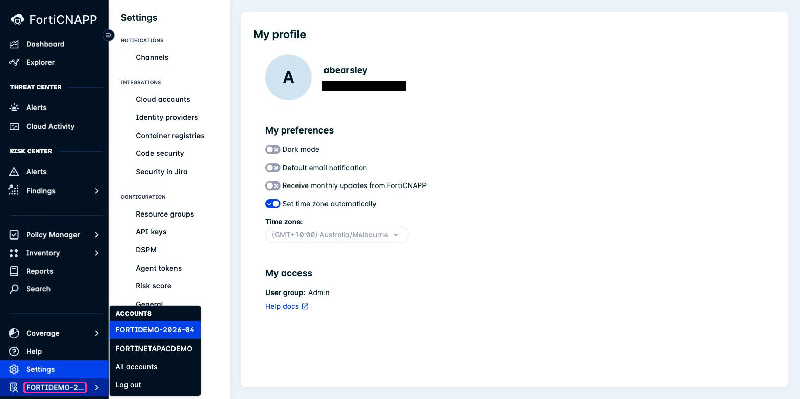

**Checkpoint:** the bottom of the left navigation reads `FORTIDEMO-2026-04`.

## Step 2: Turn off email notifications

Do this now, before you go any further. This tenant is noisy, and by default it will email
you about it.

1. Go to **Settings** > **My profile**.
2. Turn **off** **Default email notification**.
3. Turn **off** **Receive monthly updates from FortiCNAPP**.

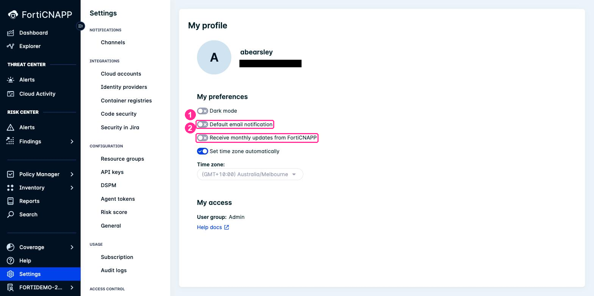

These are **your** preferences only. You are not changing anything for anyone else in the
tenant.

> Repeat this in **Lab 3**, the first time you enter FORTINETAPACDEMO. The setting is per
> tenant.

## Step 3: How bad is it?

Go to **Dashboard**.

The widgets across the top are where you start. Everything else in the console drills into
one of them.

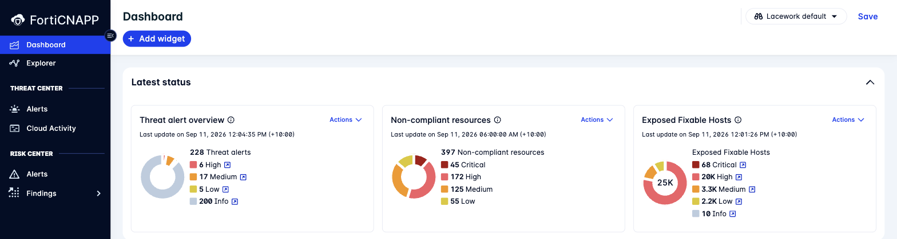

| Widget | What it counts | Which lab creates it |
|---|---|---|
| **Threat alert overview** | Something is happening that looks like an attack | Lab 3, AWS CloudTrail and agentless |
| **Non-compliant resources** | Configuration that fails a benchmark | Lab 3, AWS configuration |
| **Exposed Fixable Hosts** | Internet-reachable hosts with a patchable vulnerability | Labs 3 to 5 |

**Checkpoint:** you can read a number off each of the three widgets.

> Worth pausing on **Exposed Fixable Hosts**. Not "hosts with vulnerabilities", which is
> every host. Exposed, and fixable. That is the list you would actually work through on a
> Monday morning.

## Step 4: Show me the exposed hosts

**Explorer** answers questions about how things connect, rather than listing them.

1. Go to **Explorer**.
2. Click **Or use the Query Builder**.
3. Leave **SHOW** set to **Hosts**.
4. Click **Add clause**, choose **Internet Exposed**, leave it **True**, and click
   **Add clause**.
5. Click **Search Results**.

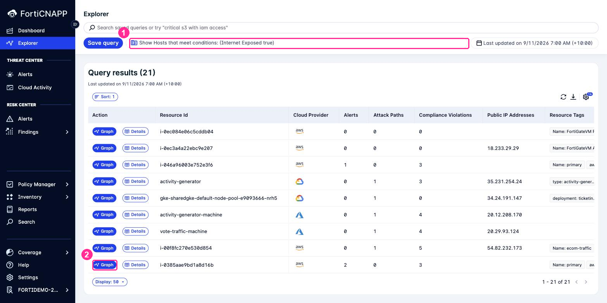

Every one of these hosts can be reached from the internet. The columns beside them say how
much trouble each one is in.

6. Pick a row with a non-zero number under **Alerts** or **Attack Paths**, and click
   **Graph**.
7. Zoom in with the **+** control.

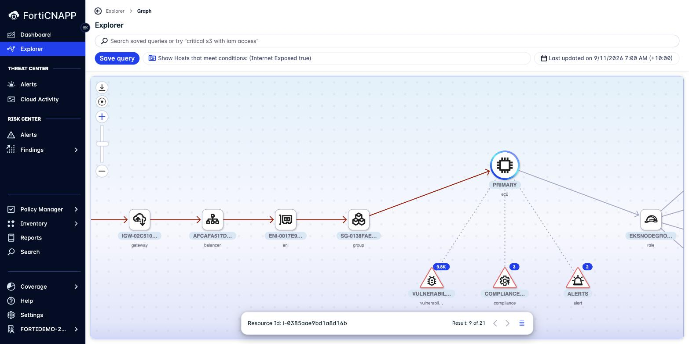

**Checkpoint:** you can trace the red line from the internet gateway to the host.

Read it left to right: internet gateway, load balancer, network interface, security group,
then the host. That red line **is** the exposure, drawn as the actual chain of AWS
resources that permits it. Hanging underneath are the host's vulnerabilities, compliance
violations and alerts.

Everything on one screen, including why those findings matter together rather than
separately.

## Step 5: What have I got?

What exists is one question. What it actually does is another. Separate views for each.

### What exists

Go to **Inventory** > **Resource Inventory**.

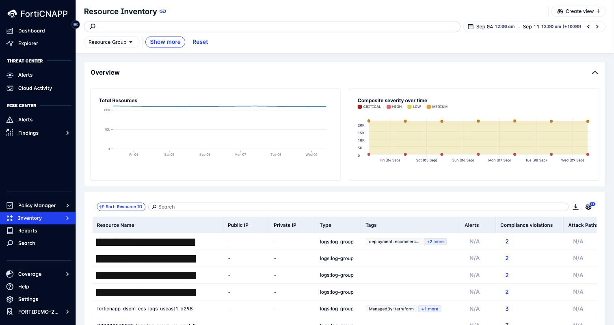

Nobody typed this in. FortiCNAPP asked AWS what exists. In a data centre you know what is
in the rack because you put it there. In a cloud account, anyone with credentials can
create something at three in the morning, so asking the provider is the only way to know.

### What it does

Go to **Inventory** > **Hosts**, then the **Machines** tab. Give it a moment to load.

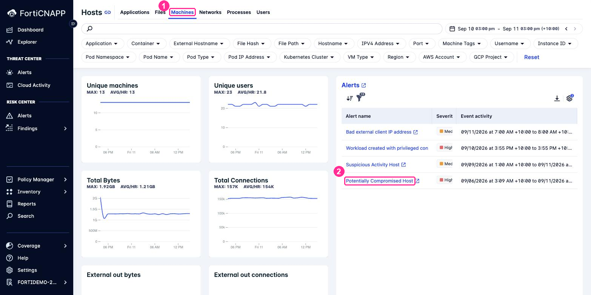

Look at the tabs: **Applications**, **Files**, **Machines**, **Networks**, **Processes**,
**Users**. Every one is a record of behaviour over time, not a snapshot.

**Checkpoint:** you can read **MAX** and **AVG/HR** off the Unique machines widget.

> **This is the polygraph.** FortiCNAPP watches what normally runs, who normally logs in,
> and what normally talks to what, then builds a baseline per host. It does not need a
> signature for an attack it has never seen. It needs to know that this machine has never
> done this before.
>
> That is why the agent in Labs 4 and 5 matters. A scan tells you what is installed. Only
> something watching continuously can tell you that behaviour changed.

## Step 6: What is happening right now?

Go to **Threat Center** > **Alerts**.

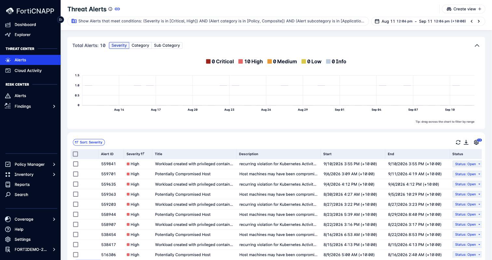

The view opens on **Critical and High, last month**.

1. Open an alert titled **Potentially Compromised Host**.
2. Read the description and the affected resource.
3. Look at **Threat Center** > **Cloud Activity**, the CloudTrail record of who did what.

**Checkpoint:** you have opened one alert and can say which host it refers to.

### Now find a composite alert

Most alerts fire on a single rule. A **composite** alert is assembled from several signals
that only mean something together, which is why they are rare and why they are worth
looking at when they appear.

1. Click the filter bar at the top and set **Alert category** to **Composite** only.
2. Set the date range to the **last 6 months**. A month is not long enough to catch one.
3. Look for **Potentially Compromised AWS Keys**.

**Checkpoint:** a composite alert is open, with the behaviours that triggered it visible.

A key used from somewhere new is odd. A key used from somewhere new, at an unusual hour, to
list resources it has never touched, is how a stolen credential behaves. Nothing in that
list is an alert on its own.

> This is the same machinery as the polygraph from Step 5, pointed at identities instead of
> hosts, and it is why Lab 3 onboards CloudTrail.

There is a second inbox at **Risk Center** > **Alerts**. Threat alerts say something is
happening. Risk alerts say something is dangerous. Worth knowing both exist.

## Step 7: What do I fix first: the toxic combinations

Go to **Risk Center** > **Findings** > **Attack Path**.

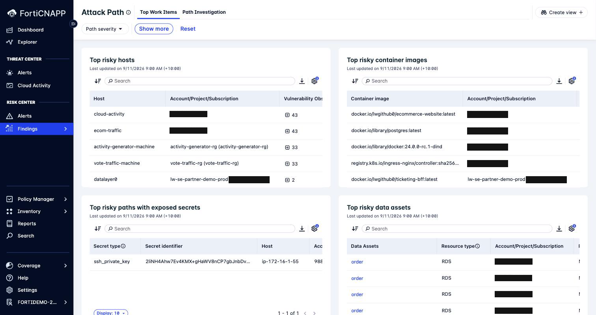

Attack Path only lists combinations that are genuinely reachable and genuinely damaging: a
vulnerable host that is internet-facing **and** holds credentials to something valuable.

**Checkpoint:** find the entry under **Top risky paths with exposed secrets**. That is a
private key sitting on a reachable host.

One vulnerability on an isolated box is a ticket. The same vulnerability on an
internet-facing box with a key to the database is an incident.

## Step 8: What do I fix first: compliance

Go to **Risk Center** > **Findings** > **Compliance** > **Cloud**.

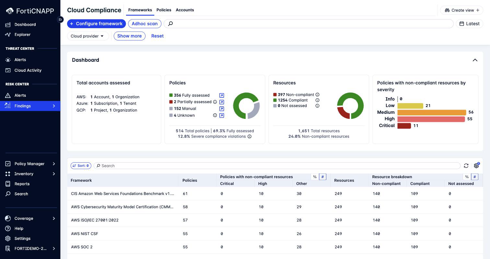

The **Frameworks** tab scores the same findings against CIS, ISO/IEC 27001, NIST CSF, SOC 2
and the rest. You do not re-scan for each one.

Now find a specific failure.

1. Click the **Policies** tab. It opens already filtered to
   **Status = Has non-compliant resources**, which is the only filter that matters when you
   are deciding what to do today.
2. Search for `permission to everyone`.

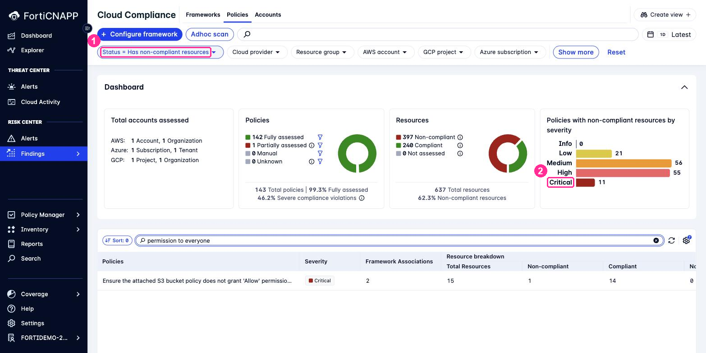

3. Open **Ensure the attached S3 bucket policy does not grant 'Allow' permission to
   everyone**. It is **Critical**.

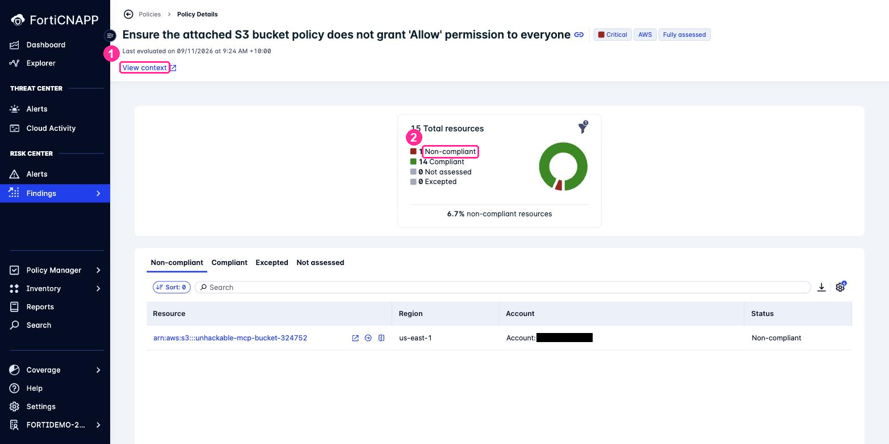

**Checkpoint:** 15 resources assessed, exactly **1** non-compliant, and you can see which
bucket it is.

One bucket in fifteen, with a policy granting access to everyone. Note the bucket's name
while you are here. Confidence is not a control.

4. Click **View context**, top left.

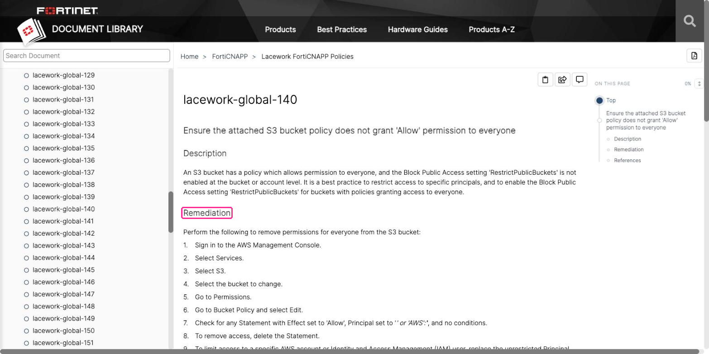

**Checkpoint:** you are reading the **Description** and a numbered **Remediation** for that
exact policy.

This is the part people miss. Every policy links straight to what it means and the steps to
fix it, so a finding is never just a red number. Hand this page to whoever owns the bucket.

## Step 9: What do I fix first: identities

Go to **Risk Center** > **Findings** > **Identities**, then the **Top Identity Risks** tab.

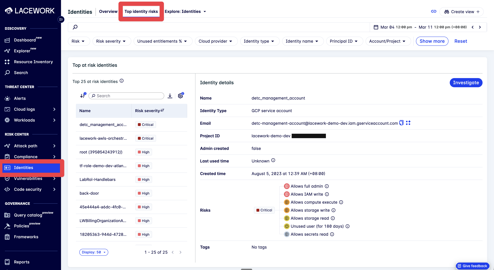

Click the top identity and read the **Risks** panel on the right.

**Checkpoint:** find an identity that allows full admin, and check its **Last used time**.

A role that can do everything and has never been used is the cheapest fix in cloud
security. Nothing breaks when you remove it. One less thing for an attacker to find. Identity is usually the shortest path from a foothold to real damage.

## Step 10: What do I fix first: vulnerabilities

Go to **Risk Center** > **Findings** > **Vulnerabilities**, then the **Top items** tab.

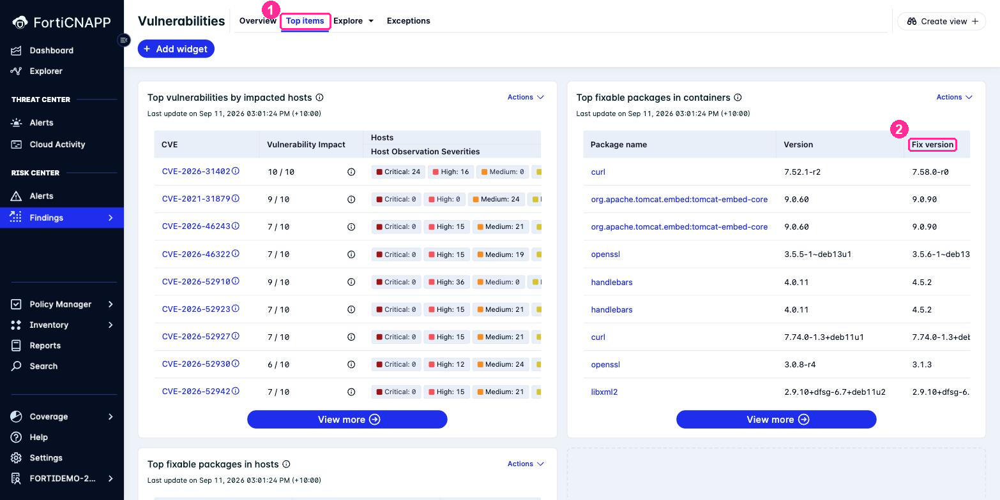

The widgets answer different questions:

| Widget | Answers |
|---|---|
| **Top vulnerabilities by impacted hosts** | Which CVE is on the most machines |
| **Top fixable packages** | Which single upgrade closes the most CVEs |

**Checkpoint:** find a package where one **Fix version** clears several CVEs at once.

The second widget is the one to work from. Patching by CVE is endless. Patching by package
is finite. The **Fix version** column tells you exactly where to get to.

## Step 11: Could I have caught it earlier?

Go to **Risk Center** > **Findings** > **Code Security**.

**Infrastructure (IaC)** scans the Terraform and CloudFormation that builds the
infrastructure.

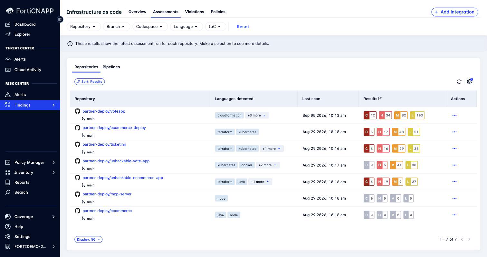

**Applications** scans what your code depends on.

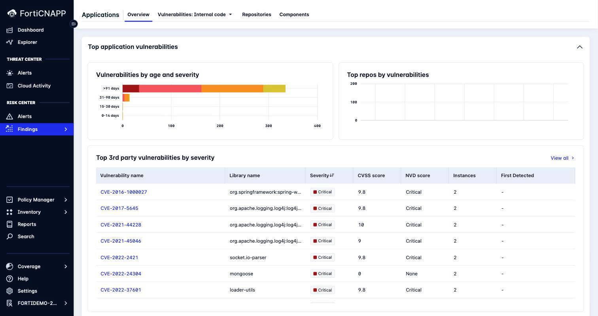

**Checkpoint:** find a Log4j CVE in the Applications list. You already know that one.

Everything up to this point finds problems that are already running. This finds them in the
code, before they exist in AWS. You do both in Labs 7 and 8.

## What did we do here?

We went from "how bad is it" to "how would I have prevented it", which is the same path you
walk during a real incident.

Hold on to those questions, because the rest of the workshop answers them:

| Question | You built it in |
|---|---|
| What have I got, and is it compliant | Lab 3 |
| What is happening on my workloads | Labs 4 and 5 |
| Could I have caught it in code | Labs 7 and 8 |

Next: [Lab 2: Get Temporary AWS Credentials](../lab-02/README.md).
