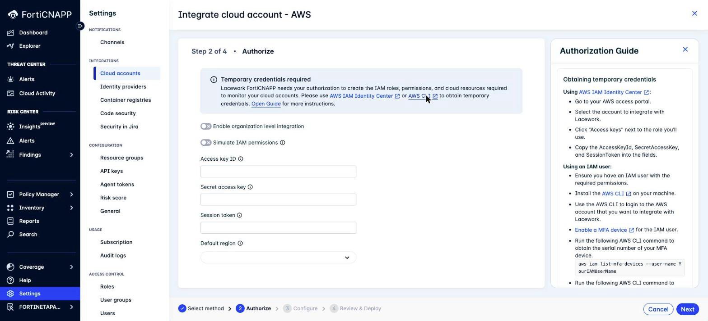
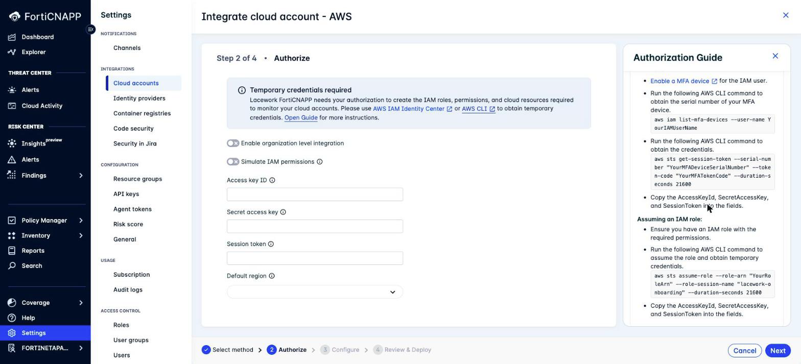

# Lab 2: Get Temporary AWS Credentials

## Objectives

Automated configuration builds your integration for you. To do that, FortiCNAPP needs AWS
credentials with enough permission to create IAM roles, buckets, keys and queues.

You do not hand over a long-lived access key. You hand over a short-lived one. In this
lab, we'll generate temporary AWS STS credentials. FortiCNAPP uses them once to build the
integration, then discards them and runs on the cross-account role it created.

## Prerequisites

- AWS account with administrator access
- One of: AWS IAM Identity Center access, an IAM user, or an assumable IAM role

## The guide is built into the console

FortiCNAPP ships these instructions in the product. On the **Authorize** step of the
wizard, click **Open Guide** to open the Authorization Guide panel.



Use this lab to prepare your credentials before you start Lab 3, so the wizard does not
sit waiting while you go and find them.

## Lab Steps

**Pick your method from how you signed in to AWS.** This is not a preference, it is a
constraint.

| How you signed in | Use | Why |
|---|---|---|
| AWS IAM Identity Center (SSO) | **Method A** | Your console session already runs on temporary credentials, and AWS refuses to mint a session from a session. CloudShell cannot help you. |
| IAM user with a password | **Method B** | CloudShell can request a session for an IAM user. |
| You have a dedicated onboarding role | **Method C** | Assume the role and use its session. |

> **The trap.** Running `aws sts get-session-token` from CloudShell in an SSO session fails
> with `AccessDenied: Cannot call GetSessionToken with session credentials`. Fortinet staff
> onboarding their own accounts will hit this every time. Use Method A.

#### Not sure which one you are?

Open CloudShell and run:

```bash
aws sts get-caller-identity --query Arn --output text
```

Read the ARN:

| The ARN looks like | You are | Use |
|---|---|---|
| `arn:aws:sts::<id>:assumed-role/AWSReservedSSO_...` | Federated through Identity Center | Method A |
| `arn:aws:iam::<id>:user/<name>` | A plain IAM user | Method B |
| `arn:aws:sts::<id>:assumed-role/<your-role>/...` | Already in an assumed role | Method C |

### Method A: AWS IAM Identity Center

1. Go to your AWS access portal.
2. Select the account you want to integrate.
3. Click **Access keys** next to the role you will use.
4. Select **Option 3: Use individual values in your AWS service client**.
5. Copy these three values:
   - **AccessKeyId**
   - **SecretAccessKey**
   - **SessionToken**

Go to Lab 3.

### Opening CloudShell

Methods B and C need it. Method A does not.

CloudShell has the AWS CLI preinstalled and already signed in as your console identity, so
you install nothing and configure nothing.

1. Log into the AWS Console.
2. Change to your local region using the region selector at the top right, for example
   **Asia Pacific (Singapore)**.
3. Click the **CloudShell** icon in the toolbar at the top right, or search for
   **CloudShell** in the console search bar.
4. Wait for the shell prompt.

### Method B: CloudShell, signed in as an IAM user

You signed into the console as an IAM user, so CloudShell can mint temporary credentials
for you in one command. No MFA setup, no access keys to handle.

1. Run this in CloudShell:

   ```bash
   aws sts get-session-token --duration-seconds 21600
   ```

2. Copy these three values from the `Credentials` block of the output:
   - `AccessKeyId`
   - `SecretAccessKey`
   - `SessionToken`

   To copy from CloudShell, select the text and use **Actions** > **Copy**.

That is the whole step. Go to Lab 3.

> **If the command fails** with `Cannot call GetSessionToken with session credentials`,
> your console session is federated rather than a plain IAM user session. Use Method A.
>
> If your account has no Identity Center either, and you hold a long-lived access key pair
> for the IAM user, configure it in CloudShell first and request the session from that
> profile:
>
> ```bash
> aws configure --profile onboarding      # paste the long-lived key pair
> aws sts get-session-token --profile onboarding --duration-seconds 21600
> ```
>
> A long-lived key pair is long-term credentials, so STS will issue a session from it.

#### Variant: when the account requires MFA

Some accounts deny STS calls that are not MFA-authenticated. If `get-session-token`
returns an access-denied error, add your MFA device.

1. Enable an MFA device for the IAM user. See
   <a href="https://docs.aws.amazon.com/IAM/latest/UserGuide/id_credentials_mfa_enable.html" target="_blank">Enable a MFA device</a>.
2. Find the device serial number:

   ```bash
   aws iam list-mfa-devices --user-name YourIAMUserName
   ```

3. Request the credentials with the MFA code:

   ```bash
   aws sts get-session-token \
     --serial-number "YourMFADeviceSerialNumber" \
     --token-code "YourMFATokenCode" \
     --duration-seconds 21600
   ```

### Method C: Assume an IAM Role

Use this when your account has a dedicated onboarding role. Run it in CloudShell.

1. Confirm the role holds the required permissions.
2. Assume the role:

   ```bash
   aws sts assume-role \
     --role-arn "YourRoleArn" \
     --role-session-name "lacework-onboarding" \
     --duration-seconds 21600
   ```

3. Copy `AccessKeyId`, `SecretAccessKey` and `SessionToken` from the `Credentials` block.



## Permissions

Fortinet recommends **full administrator access for your first deployment**. AWS
permissions here are complex, and a partial policy fails during discovery.

Once you know the flow, use least privilege instead. The Authorization Guide panel offers
four ready-made policy documents to download:

| File | Covers |
|---|---|
| `aws_config_policy.json` | Configuration integration |
| `aws_cloudtrail_policy.json` | CloudTrail integration |
| `aws_agentless_policy.json` | Agentless Workload Scanning |
| `aws_eks_auditlog_policy.json` | EKS audit log integration |

> **Gotcha**: if you plan to use the optional **Simulate IAM permissions** check in Lab 3,
> your credentials additionally need `iam:SimulatePrincipalPolicy`, plus `iam:GetRole` for
> assumed roles. A least-privilege policy without these fails the simulation, not the
> deployment.

## Important

- Set the duration to suit your session. `21600` seconds gives you six hours.
- Treat the three values as secrets. Do not paste them into chat, email or a shared doc.
- FortiCNAPP uses these credentials only to build the integration. It then runs on the
  cross-account role it created, which holds scoped read permissions.

## What did we do here?

We created a short-lived AWS credential set for the integration to run under.

This is the step that makes automated configuration safe. The CloudFormation path never
asks for a credential, because you run each stack yourself. That costs you two console
walk-throughs. Automated configuration trades those for one bounded credential, and gives
you preflight validation and automatic rollback in return.

## Additional Resources

- <a href="https://docs.fortinet.com/document/forticnapp/latest/administration-guide/331296/obtaining-temporary-cloud-account-credentials" target="_blank">FortiCNAPP Administration Guide: Obtaining temporary cloud account credentials</a>
- <a href="https://docs.aws.amazon.com/STS/latest/APIReference/API_GetSessionToken.html" target="_blank">AWS STS GetSessionToken</a>
- <a href="https://docs.aws.amazon.com/STS/latest/APIReference/API_AssumeRole.html" target="_blank">AWS STS AssumeRole</a>
