# Lab 3: Onboard AWS with Automated Configuration

## Objectives

This is the lab everything else depends on. You connect your AWS account to FortiCNAPP, so
that the findings you toured in Lab 1 start appearing for **your** account.

You hand over the hour-long credential from Lab 2. FortiCNAPP then does the work: it checks
your permissions, writes a Terraform plan for your account, applies it, and registers the
result. You watch, you do not write any of it.

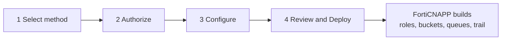

Work through the screens, then wait five to ten minutes while it builds.

**Worth knowing before you start**, because both of these catch people out:

| | |
|---|---|
| It creates real AWS resources | IAM roles, and the ECS cluster and networking the agentless scanner needs. Lab 10 removes them. Lab 12 adds the CloudTrail trail, bucket, SNS topic and SQS queue. |
| The credential expires | One hour from when you made it. If the wizard sits idle, it will fail partway. |

## Prerequisites

- Completed [Lab 2: Get Temporary AWS Credentials](../lab-02/README.md)
- Temporary AWS credentials that have not expired
- FortiCNAPP console access, tenant **FORTINETAPACDEMO**

## Lab Steps

### Step 1: Open Cloud Accounts

1. Log into the FortiCNAPP console at <a href="https://partner-demo.lacework.net/" target="_blank">https://partner-demo.lacework.net/</a>
2. Confirm the tenant selector at the bottom left shows **FORTINETAPACDEMO**.
> [!IMPORTANT]
> **This is a different tenant to Lab 1.** Lab 1 ran in `FORTIDEMO-2026-04`. From here on
> you work in `FORTINETAPACDEMO`, because that is where you onboard your own account. If
> your screen looks unexpectedly empty, check the tenant name first.
>
> **If the switch does not take, refresh the browser.** The selector sometimes reports the
> new tenant while the page still shows the old one's data. A reload settles it.

3. **Turn off email notifications for this tenant too.** Go to **Settings** >
   **My profile**, then turn **off** **Default email notification** and **Receive monthly
   updates from FortiCNAPP**.

   The setting is per tenant, so switching tenants does not carry it across. Skip this and
   your own onboarding will email you about itself for the rest of the day.

4. Navigate to **Settings** > **Integrations** > **Cloud accounts**.
5. Click **Add New**, top right.

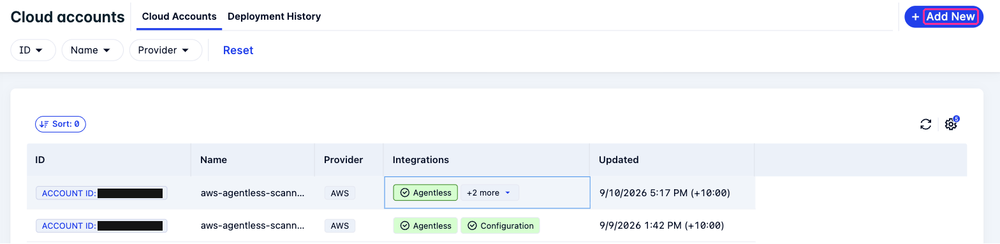

**Checkpoint:** the Integrate cloud account wizard opens on Step 1 of 4.

### Step 2: Select the Method (Step 1 of 4)

1. Under **Cloud Service Provider**, select **Amazon Web Services**.
2. Under **Integration Method**, select **Automated Configuration**.
3. Click **Next**.

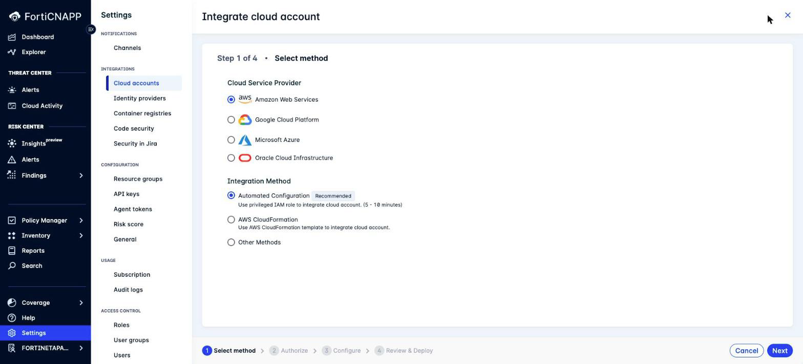

You just picked one of three ways to do the same job. The end state is identical.

| Method | What you do | Pick it when |
|---|---|---|
| **Automated Configuration** | Hand over short-lived credentials, FortiCNAPP builds everything | Default. Least typing, and the console marks it Recommended. |
| AWS CloudFormation | Launch a stack per integration, set the parameters yourself | You want to read the template before anything is created |
| Other Methods | Take the Terraform and run it yourself | You want onboarding in a pipeline, reviewed in a pull request |

Labs 11 and 12 do the Terraform route, so you can compare the two directly.

### Step 3: Authorize (Step 2 of 4)

This screen takes the credentials from Lab 2.

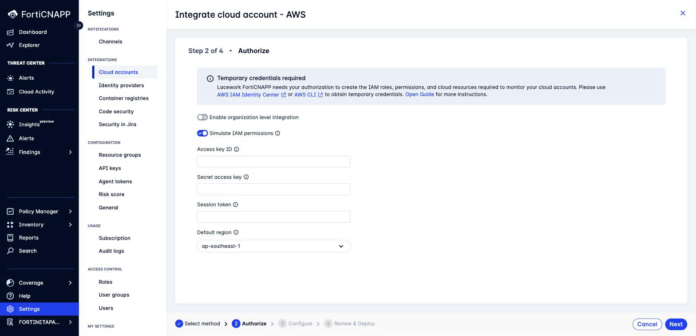

1. Leave **Enable organization level integration** off.

   Turning it on onboards every account in your AWS organization in one pass, using
   CloudFormation StackSets. That is the right choice for an account inside an AWS
   Organization. For this workshop, leave it off and integrate a single account.

2. Turn **Simulate IAM permissions** on.

   This runs an AWS IAM policy simulation during discovery. It catches denials from
   **service control policies and permission boundaries before deployment**, which is the
   usual reason onboarding fails in an enterprise AWS organization. The simulation needs
   `iam:SimulatePrincipalPolicy` on your credentials, plus `iam:GetRole` if you assumed a
   role.

3. Enter your credentials from Lab 2:
   - **Access key ID**
   - **Secret access key**
   - **Session token**

4. In **Default region**, select the region where FortiCNAPP will deploy its resources,
   for example **ap-southeast-1** for Asia Pacific (Singapore).

   > **Region matters.** Set it to the region where your workloads run. Get it wrong and
   > agentless scanning looks in an empty region, finds nothing, and reports nothing. It
   > does not warn you.

5. Click **Next**.

**Checkpoint:** the wizard moves to Step 3 of 4. If it refuses, your credential is the
problem, not the form. See the failure table at the end of
[Lab 2](../lab-02/README.md#if-it-goes-wrong-in-lab-3).

> Need the credential instructions again? Click **Open Guide** in the blue banner. The
> Authorization Guide panel covers all three credential methods and offers the
> least-privilege IAM policy files for download.

### Step 4: Configure (Step 3 of 4)

Task 1 of 3 is **Select Integration**. Each integration type is a **toggle**, and all four
start off. The console lists them in this order, each tagged with the CNAPP capability it
provides:

| Toggle | Tagged as | What it gives you |
|---|---|---|
| **Agentless Workload Scanning** | Cloud Vulnerability Management | Vulnerability and secret scanning with no agent on the instance |
| **Configuration** | Cloud Security Posture Management | Resource inventory, compliance assessment, risk analysis |
| **CloudTrail** | Cloud Threat Detection | AWS CloudTrail ingestion. Creates its own trail by default. |
| **EKS Audit Log** | Kubernetes Security Posture Management | EKS audit log ingestion. Leave it off unless this account runs EKS. |

Turn on two toggles, and only two:

1. **Agentless Workload Scanning**
2. **Configuration**

**Leave the CloudTrail and EKS Audit Log toggles off.**

> [!IMPORTANT]
> **CloudTrail comes next, in [Lab 4](../lab-04/README.md).** It uses CloudFormation
> instead, for reasons that lab explains. Leave the toggle off here.

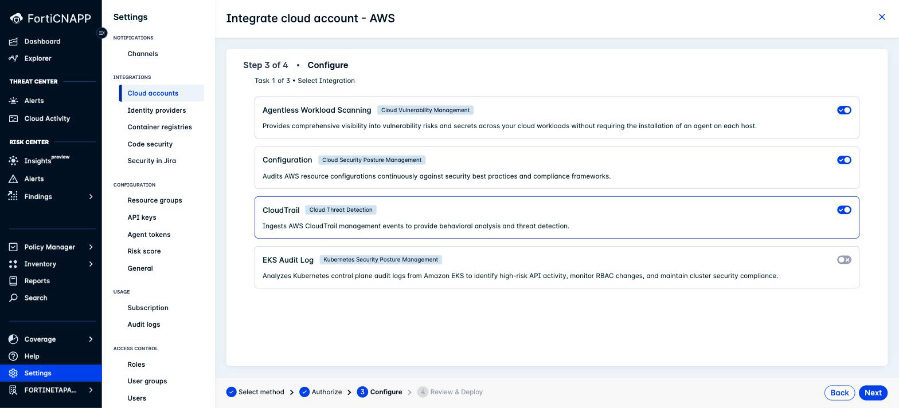

> **Two toggles here, the third arrives in Lab 4.** Posture and vulnerability scanning
> from the wizard, threat detection from a CloudFormation template. Mixing methods is a
> common production pattern, not a workaround.

#### Set the agentless scanning regions

The Configure step runs three tasks. After you select the integration types and discovery
completes, Task 3 asks for per-integration settings.

1. On the **Agentless Workload Scanning** tab, set **Scanning regions** to the region where
   your workloads run, for example **ap-southeast-1**.

   > [!IMPORTANT]
   > **Scanning regions is required and starts empty.** The wizard will not let you leave
   > this step until you set it, and the error only appears once you try to advance.

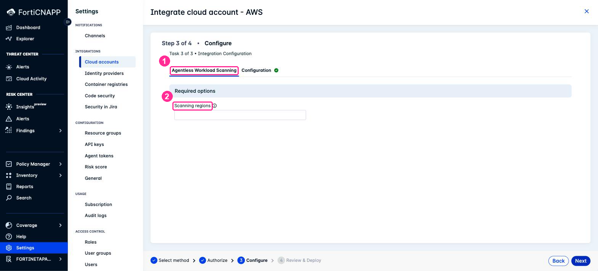

2. On the **Configuration** tab, leave **Advanced options** alone.

There are only two tabs. A tab appears per selected integration type, so CloudTrail and
EKS Audit Log have none here.

> The **Configuration** tab's **Advanced options** panel holds one setting, a **Use an
> existing IAM role** toggle, off by default. Turn it on when the account already has a
> Lacework cross-account role you want to keep. Automated configuration does not detect an
> existing role on its own.

### Step 5: Review and Deploy (Step 4 of 4)

This step is a read-only summary. **Account Overview** repeats your credentials, region
and integration level, then one panel per selected integration type repeats its settings.

1. Read **Account Overview** and confirm the region and integration level.
2. Read each integration panel.
3. Click **Deploy**.

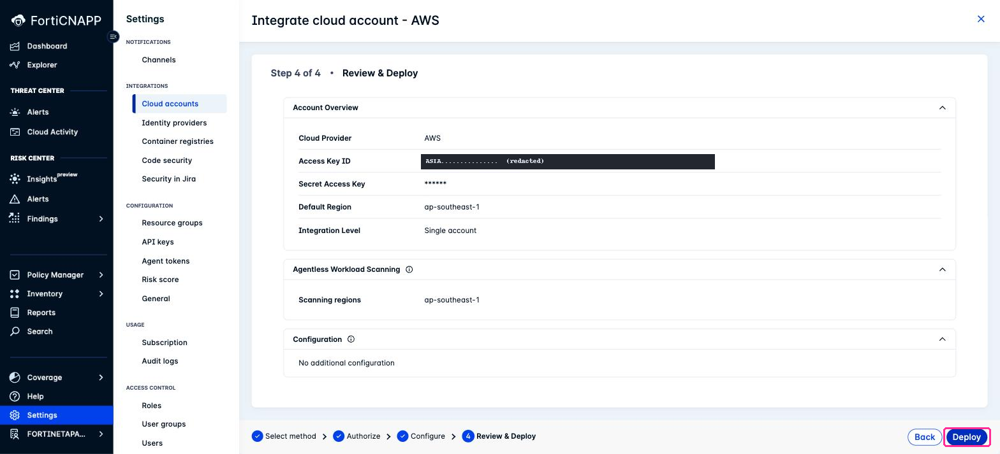

> [!NOTE]
> **The panels collapse, they do not edit.** Clicking a value does nothing. To change a
> setting, click **Back** and return to the Configure step.

> **Nothing has been created yet.** Everything up to this point was a dry run against your
> account. The permission check already ran, in Task 2 of the Configure step, so a missing
> permission stops you there with an empty account rather than halfway through a deployment
> with half the resources built.

### Step 6: Watch the Deployment

FortiCNAPP generates a Terraform plan, applies it, and registers each integration. It
creates IAM roles and policies, storage, encryption keys and messaging services. Where it
needs logic that infrastructure provisioning cannot express, such as registering the
integration itself, it deploys short-lived Lambda helpers and then removes them.

Wait for all selected integration types to complete. Allow 5 to 10 minutes. This is a good
moment to stretch.

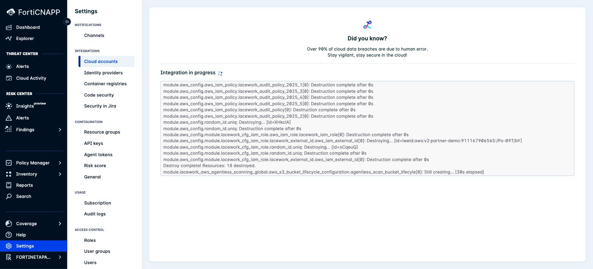

**Checkpoint:** every integration type you selected reads **SUCCEEDED**. If any reads
**FAILED**, read the next box before you retry anything.

> **Read the status per integration type.** Rollback applies to the integration type that
> failed, not to the others. In our test run Agentless completed and stayed deployed while
> Configuration rolled back its own 18 resources. So check each row on the deployment
> record rather than assuming the run was all-or-nothing.

Every run is recorded under **Settings** > **Integrations** > **Cloud accounts** >
**Deployment History**, successes and failures alike. That is where you troubleshoot a
failed onboarding.

### Step 7: Review What Was Created

The wizard closes on its own and leaves you on the deployment record.

1. Expand each integration type to view the cloud resources created for it.
2. Click **Cloud Accounts** in the breadcrumb when you have finished reading.

You can return to this record at any time. Go to **Settings** > **Integrations** >
**Cloud accounts** and select the **Deployment History** tab.

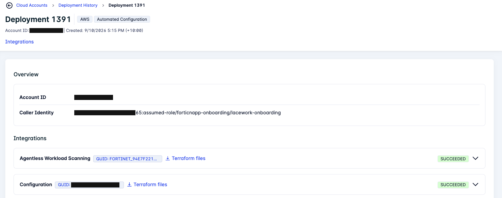

The record repays reading properly:

- **Caller identity**: the exact AWS principal used to deploy. This is what answers "who
  created these resources" six months later.
- **Per-integration status**: SUCCEEDED or FAILED, integration by integration.
- **Resources**: every resource created, by ARN, name and type.
- **Terraform files**: download what FortiCNAPP generated for each integration.

That last one matters. **Automated configuration is not a black box.** It writes Terraform,
and you can take that Terraform away. Onboard with the wizard, download the generated
files, and commit them to your own repository.

Every resource is tagged with two keys, `lacework_tag` and `lacework_integration`. The
deployment record shows the values for your run.

Read the keys, not the values. The values move between product versions, so Lab 10 searches
on the key alone.

Remember these tags. Lab 10 uses them for cleanup.

### Step 8: Verify the Integrations

1. Return to **Settings** > **Integrations** > **Cloud accounts**.
2. Confirm your AWS account ID appears in the list.
3. Confirm the **Integrations** column shows **Configuration** and **Agentless**.
   CloudTrail is not there yet. Lab 4 adds it with CloudFormation.

### Step 9: Confirm the AWS Side

Switch to the AWS Console and confirm the resources exist.

First, see the trail that caused you to skip CloudTrail in Step 4. From CloudShell:

```bash
aws cloudtrail describe-trails --region ap-southeast-1 \
  --query "trailList[].[Name,IsOrganizationTrail]" --output text
```

Any row with `IsOrganizationTrail` **True** is an organization trail your account can see
but cannot manage. Those are the ones discovery cannot resolve:

```
aws-controltower-BaselineCloudTrail   True
```

You may see more than one. A Control Tower landing zone creates its own baseline trail, and
many organizations add a second trail of their own on top.

You will run this command again at the end of Lab 12, where a trail with **False** in that
column appears alongside it. That one is yours.

1. Go to **IAM** > **Roles** and search for `lw-`. The Configuration integration's
   cross-account role is named `lw-iam-` plus a random suffix. Searching for `lacework`
   returns the four agentless roles instead.
2. Open the `lw-iam-` role and select the **Trust relationships** tab. The trusted
   principal is a role in the FortiCNAPP AWS account, and the `StringEquals` condition on
   it is the external ID.
3. Go to **Amazon ECS** > **Clusters**. Confirm the agentless scanner cluster exists. Its
   name starts `lacework-agentless-scanning-cluster-`.

> **Two integrations, two naming schemes.** Configuration creates one role and a set of
> `lwaudit-policy-` policies. Agentless creates four roles, an ECS cluster, and its own
> networking. Both carry the `lacework_tag` key, which is how Lab 10 finds them.

## Troubleshooting

All of these came up while building the lab.

### Discovery fails on an AWS Organization trail

```
TrailNotFoundException: Unknown trail: aws-controltower-BaselineCloudTrail
for the user: <your account id>
```

**Cause**: the account is a member of an AWS Organization with an organization-wide
CloudTrail, often created by Control Tower. A member account sees that trail as a shadow
trail, and AWS requires the full trail ARN to look one up rather than the name.

**What to do**: this is why Step 4 has you leave the CloudTrail toggle off.
[Lab 4](../lab-04/README.md) adds it with CloudFormation, which has no discovery step for
the organization trail to break.

For CloudTrail coverage across a whole organization, run an **organization level**
integration from the management account.

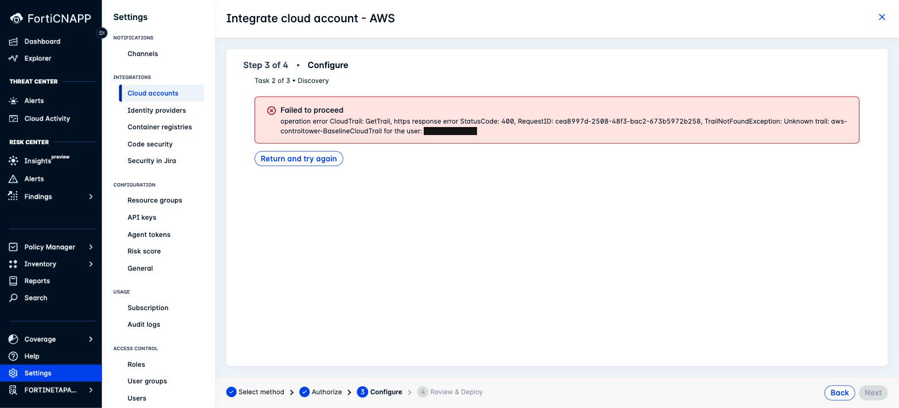

### The AWS account already has that integration type

```
Error creating AwsCfg integration: [400]
The provided aws account is already used in this Lacework Application.
```

**Cause**: a Configuration integration already exists for this AWS account in this
FortiCNAPP tenant.

**What happens**: the run completes its Terraform stage, then rolls back cleanly. Nothing
is left behind in AWS.

**What to do**: delete the existing integration first, then use **Redeploy integrations**.

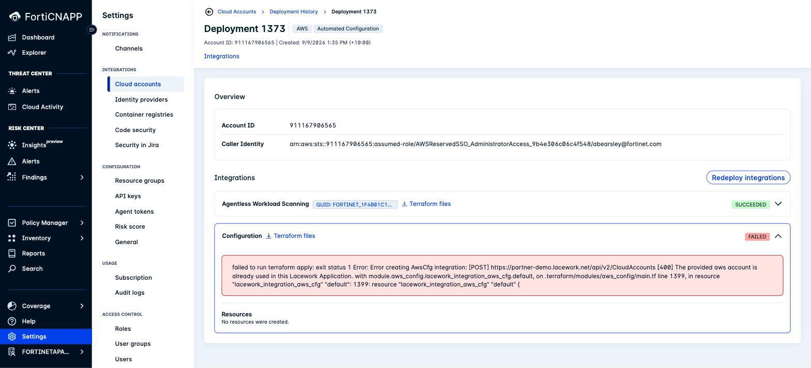

### Retrying without restarting the wizard

The deployment record has a **Redeploy integrations** button. It reuses the stored
configuration, so you do not add the cloud account again. Integration types that already
succeeded are greyed out. You do have to supply temporary credentials again.

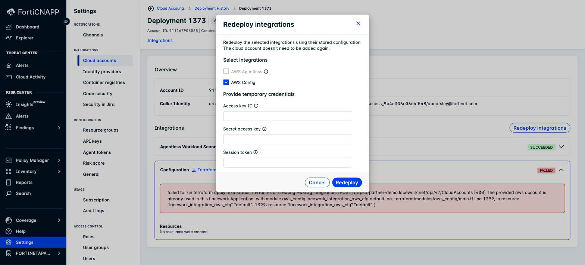

## Data timing

Data does not appear instantly.

| Data | First appears |
|---|---|
| CloudTrail events | Within 15 minutes of the trail being created in Lab 12 |
| Resource inventory and compliance | Up to 24 hours on the scheduled cycle |
| Agentless scan results | After the first scan, on a 24 hour cycle by default |

To avoid waiting for the inventory scan, Lab 7 triggers one on demand with the Lacework CLI.

## Where the data goes

FortiCNAPP analyses data **inside** your cloud account. File contents and resource
contents never leave your network. Only assessment results are sent to the FortiCNAPP
platform. Those results are stored as JSON files in a single storage bucket in your own
account. You can read them and see exactly what you are sending.

Source: the Authorization Guide panel in the wizard, "Data privacy and security".

## What did we do here?

We onboarded an AWS account into FortiCNAPP from one wizard: configuration assessment and
agentless vulnerability scanning. Lab 4 adds CloudTrail threat detection with a
CloudFormation template.

Compare the work:

| | CloudFormation path | Automated configuration |
|---|---|---|
| Labs | 2 | 1 |
| CloudFormation stacks you launch | 2 | 0 |
| Stack parameters you set by hand | Several, including a quota check | 0 |
| Preflight permission check | None | Yes, including SCPs and permission boundaries |
| Behaviour on failure | Stack fails, integration record remains | Full rollback |
| Cleanup | Delete each stack, then delete the integration record separately | Tag search |

The trade is credentials. The CloudFormation path never asks for an AWS credential,
because you launch each stack yourself. Automated configuration needs one bounded
credential. Usually worth it, because temporary STS credentials keep the exposure
contained.

## Additional Resources

- <a href="https://docs.fortinet.com/document/forticnapp/latest/administration-guide/123850/automated-configuration" target="_blank">FortiCNAPP Administration Guide: Automated configuration</a>

---

Next: [Lab 4: Add CloudTrail with CloudFormation](../lab-04/README.md).
