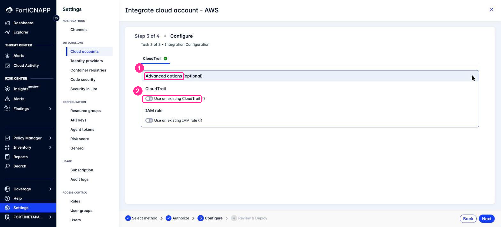

# Lab 3: Onboard AWS with Automated Configuration

## Objectives

This is the lab that replaces two.

In the CloudFormation workshop, you deploy the Configuration and CloudTrail integration in
one lab, then the Agentless Workload Scanning integration in another. Two console
walk-throughs, two stacks, two sets of parameters to get right.

Automated configuration does all of it in one four-step wizard. FortiCNAPP validates your
permissions, generates a Terraform plan for your account, applies it, and registers the
integrations. In this lab we'll onboard the AWS account, then look at what FortiCNAPP
created and how it is tagged.

FortiCNAPP estimates **5 to 10 minutes** for the deployment.

## Prerequisites

- Completed [Lab 2: Get Temporary AWS Credentials](../lab-02/README.md)
- Temporary AWS credentials that have not expired
- FortiCNAPP console access, tenant **FORTINETAPACDEMO**

## Lab Steps

### Step 1: Open Cloud Accounts

1. Log into the FortiCNAPP console at <a href="https://partner-demo.lacework.net/" target="_blank">https://partner-demo.lacework.net/</a>
2. Confirm the tenant selector at the bottom left shows **FORTINETAPACDEMO**.
3. Navigate to **Settings** > **Integrations** > **Cloud accounts**.
4. Click **Add New**.

### Step 2: Select the Method (Step 1 of 4)

1. Under **Cloud Service Provider**, select **Amazon Web Services**.
2. Under **Integration Method**, select **Automated Configuration**.
3. Click **Next**.


You just picked one of three ways to do the same job. The end state is identical.

| Method | What you do | Pick it when |
|---|---|---|
| **Automated Configuration** | Hand over short-lived credentials, FortiCNAPP builds everything | Default. Least typing, and the console marks it Recommended. |
| AWS CloudFormation | Launch a stack per integration, set the parameters yourself | You want to read the template before anything is created |
| Other Methods | Take the Terraform and run it yourself | The customer wants onboarding in a pipeline, reviewed in a pull request |

Labs 10 and 11 do the Terraform route, so you can compare the two directly.

### Step 3: Authorize (Step 2 of 4)

This screen takes the credentials from Lab 2.


1. Leave **Enable organization level integration** off.

   Turning it on onboards every account in your AWS organization in one pass, using
   CloudFormation StackSets. That is the right choice for a customer with an AWS
   Organization. For this workshop, leave it off and integrate a single account.

2. Turn **Simulate IAM permissions** on.

   This runs an AWS IAM policy simulation during discovery. It catches denials from
   **service control policies and permission boundaries before deployment**, which is the
   usual reason onboarding fails in an enterprise AWS organization. The simulation needs
   `iam:SimulatePrincipalPolicy` on your credentials, plus `iam:GetRole` if you assumed a
   role.

3. Enter your credentials from Lab 2:
   - **Access key ID**
   - **Secret access key**
   - **Session token**

4. In **Default region**, select the region where FortiCNAPP will deploy its resources,
   for example **ap-southeast-1** for Asia Pacific (Singapore).

   > **Region matters.** Set it to the region where your workloads run, or agentless
   > scanning looks in the wrong place. This is the equivalent of the region selector step
   > in the CloudFormation labs.

5. Click **Next**.

> Need the credential instructions again? Click **Open Guide** in the blue banner. The
> Authorization Guide panel covers all three credential methods and offers the
> least-privilege IAM policy files for download.

### Step 4: Configure (Step 3 of 4)

Select the integration types to deploy.

| Integration type | What it gives you |
|---|---|
| **Configuration** | Resource inventory, compliance assessment, risk analysis |
| **CloudTrail** | AWS CloudTrail ingestion for threat detection. Creates its own trail by default. |
| **Agentless Workload Scanning** | Vulnerability and secret scanning with no agent on the instance |
| **Kubernetes audit log** | EKS audit log ingestion. Skip it unless this account runs EKS. |

Select **Configuration**, **CloudTrail** and **Agentless Workload Scanning**.

> **Skip CloudTrail if your AWS account is a member of an AWS Organization that has an
> organization trail**, which most corporate accounts are. Discovery fails on it. See the
> troubleshooting section below.
>
> Student and standalone accounts are not affected. Select CloudTrail and you get threat
> detection working in the same pass.


> This one selection covers what Labs 2 and 3 of the CloudFormation workshop deploy as two
> separate stacks.

#### Set the agentless scanning regions

The Configure step runs three tasks. After you select the integration types and discovery
completes, Task 3 asks for per-integration settings.

1. On the **Agentless Workload Scanning** tab, set **Scanning regions** to the region where
   your workloads run, for example **ap-southeast-1**.
2. On the **CloudTrail** tab, expand **Advanced options** and leave **Use an existing
   CloudTrail** off.

   Off is the default, and off is what you want. FortiCNAPP then creates its own trail,
   S3 bucket, SNS topic and SQS queue. Nothing has to exist in the account beforehand.

   Turn it on only for a customer who already has a trail they want FortiCNAPP to read.

3. On the **Configuration** tab, leave **Advanced options** alone.




> The same **Advanced options** panel holds a **Use an existing IAM role** toggle, shown in
> the screenshot above. Use it when a customer already has a Lacework cross-account role
> they want to keep. Automated configuration does not detect an existing role on its own.

### Step 5: Review and Deploy (Step 4 of 4)

FortiCNAPP runs preflight validation against your account. It confirms the required
permissions exist, checks the prerequisite services are enabled, and discovers existing
resources it can reuse rather than duplicate.

1. Review the discovery summary.
2. Expand an integration if you want to change its settings before deploying.
3. Click **Deploy**.


> **This is the step the CloudFormation path does not have.** A CloudFormation stack finds
> out about a missing permission when it fails halfway through. Automated configuration
> tells you before it creates anything.

### Step 6: Watch the Deployment

FortiCNAPP generates a Terraform plan, applies it, and registers each integration. It
creates IAM roles and policies, storage, encryption keys and messaging services. Where it
needs logic that infrastructure provisioning cannot express, such as registering the
integration itself, it deploys short-lived Lambda helpers and then removes them.

Wait for all selected integration types to complete. Allow 5 to 10 minutes.


> **Read the status per integration type.** Rollback applies to the integration type that
> failed, not to the others. In our test run Agentless completed and stayed deployed while
> Configuration rolled back its own 18 resources. So check each row on the deployment
> record rather than assuming the run was all-or-nothing.

Every run is recorded under **Settings** > **Integrations** > **Cloud accounts** >
**Deployment History**, successes and failures alike. That is where you troubleshoot a
failed onboarding.

### Step 7: Review What Was Created

1. Click each integration type to view the cloud resources created for it.
2. Click **Exit**.

You can return to this record at any time. Go to **Settings** > **Integrations** >
**Cloud accounts** and select the **Deployment History** tab.


The record holds four things worth knowing about:

- **Caller identity**: the exact AWS principal used to deploy. Useful when a customer asks
  who created these resources.
- **Per-integration status**: SUCCEEDED or FAILED, integration by integration.
- **Resources**: every resource created, by ARN, name and type.
- **Terraform files**: download what FortiCNAPP generated for each integration.

That last one matters. **Automated configuration is not a black box.** It writes Terraform,
and you can take that Terraform away. A partner can onboard a customer with the wizard,
download the generated files, and hand them over for the customer's own repository.

Every resource is tagged. The exact values appear on the deployment record, for example
`lacework_tag: self-deployment` and `lacework_integration: aws_config`.

Remember these tags. Lab 6 uses them for cleanup.

### Step 8: Verify the Integrations

1. Return to **Settings** > **Integrations** > **Cloud accounts**.
2. Confirm your AWS account ID appears in the list.
3. Confirm the **Integrations** column shows Configuration, CloudTrail and Agentless.

### Step 9: Confirm the AWS Side

Switch to the AWS Console and confirm the resources exist. You can also check from
CloudShell:

```bash
aws cloudtrail describe-trails --region ap-southeast-1 \
  --query "trailList[].[Name,IsOrganizationTrail,S3BucketName]" --output text
```

A successful run returns a trail FortiCNAPP created, with `IsOrganizationTrail` **False**
and its own bucket, for example:

```
lacework-cloudtrail-7689faee   False   lacework-ct-bucket-7d009af2
```

1. Go to **CloudTrail** > **Trails**. Confirm a trail exists and is logging.
2. Go to **IAM** > **Roles**. Find the cross-account role FortiCNAPP created.
3. Open the role and select the **Trust relationships** tab. The trusted principal is the
   FortiCNAPP AWS account, protected by an external ID.
4. Go to **Amazon ECS** > **Clusters**. Confirm the agentless scanner cluster exists.

## Troubleshooting

Three situations you may hit, all seen while building this lab.

### Discovery fails on an AWS Organization trail

```
TrailNotFoundException: Unknown trail: aws-controltower-BaselineCloudTrail
for the user: <your account id>
```

**Cause**: the account is a member of an AWS Organization with an organization-wide
CloudTrail, often created by Control Tower. A member account sees that trail as a shadow
trail, and AWS requires the full trail ARN to look one up rather than the name.

**What to do**: deselect **CloudTrail** and deploy the other integration types. For
CloudTrail coverage across an organization, run an **organization level** integration from
the management account.


### The AWS account already has that integration type

```
Error creating AwsCfg integration: [400]
The provided aws account is already used in this Lacework Application.
```

**Cause**: a Configuration integration already exists for this AWS account in this
FortiCNAPP tenant.

**What happens**: the run completes its Terraform stage, then rolls back cleanly. Nothing
is left behind in AWS.

**What to do**: delete the existing integration first, then use **Redeploy integrations**.


### Retrying without restarting the wizard

The deployment record has a **Redeploy integrations** button. It reuses the stored
configuration, so you do not add the cloud account again. Integration types that already
succeeded are greyed out. You do have to supply temporary credentials again.


## Data timing

Data does not appear instantly.

| Data | First appears |
|---|---|
| CloudTrail events | Within 15 minutes of the trail being created |
| Resource inventory and compliance | Up to 24 hours on the scheduled cycle |
| Agentless scan results | After the first scan, on a 24 hour cycle by default |

To avoid waiting for the inventory scan, Lab 7 triggers one on demand with the Lacework CLI.

## Where the data goes

Worth knowing when a partner or customer asks.

FortiCNAPP analyses data **inside** your cloud account. File contents and resource
contents never leave your network. Only assessment results are sent to the FortiCNAPP
platform, and those results are stored as JSON files in a single storage bucket in your
own account. You can read them and see exactly what you are sending.

Source: the Authorization Guide panel in the wizard, "Data privacy and security".

## What did we do here?

We onboarded an entire AWS account into FortiCNAPP in one wizard: configuration
assessment, CloudTrail threat detection, and agentless vulnerability scanning.

Compare the work:

| | CloudFormation path | Automated configuration |
|---|---|---|
| Labs | 2 | 1 |
| CloudFormation stacks you launch | 2 | 0 |
| Stack parameters you set by hand | Several, including a quota check | 0 |
| Preflight permission check | None | Yes, including SCPs and permission boundaries |
| Behaviour on failure | Stack fails, integration record remains | Full rollback |
| Cleanup | Delete each stack, then delete the integration record separately | Tag search |

The trade is credentials. The CloudFormation path never asks for an AWS credential,
because you launch each stack yourself. Automated configuration needs one bounded
credential. For a partner onboarding a customer, that trade is usually worth making, and
temporary STS credentials keep it contained.

## Additional Resources

- <a href="https://docs.fortinet.com/document/forticnapp/latest/administration-guide/123850/automated-configuration" target="_blank">FortiCNAPP Administration Guide: Automated configuration</a>
