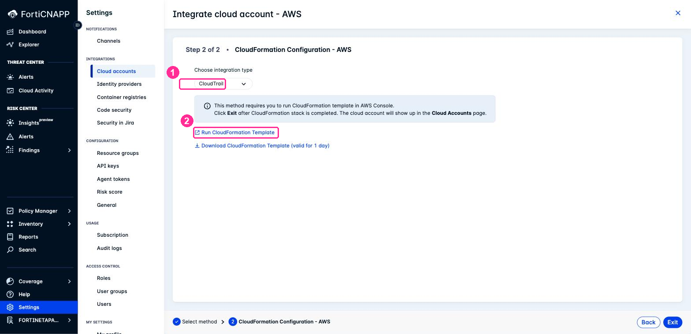

# Lab 4: Add CloudTrail with CloudFormation

## Objectives

Lab 3 onboarded Configuration and Agentless from the wizard and deliberately left
CloudTrail off. This lab adds it, using a different method.

CloudTrail is what gives FortiCNAPP **threat detection**: who called which API, from where,
and whether that is normal for this account. Configuration tells you a bucket is public.
CloudTrail tells you who made it public, at 3am, from an IP the account has never seen.

| | Automated Configuration, Lab 3 | CloudFormation, this lab |
|---|---|---|
| Who builds the resources | FortiCNAPP, from credentials you hand over | You, from a template, in your own console |
| What it needs from you | Short-lived credentials | Nothing. You are already signed in |
| Where it runs | FortiCNAPP's side | Your AWS account |
| Best for | Fast onboarding of a whole account | Estates where CloudFormation is the standard, and any account the wizard cannot read |

You will run a CloudFormation template that creates a new CloudTrail trail and registers it
with FortiCNAPP in one pass.

## Prerequisites

- Completed [Lab 3](../lab-03/README.md)
- AWS Console access to the same account, with permission to create IAM resources
- FortiCNAPP console access, tenant **FORTINETAPACDEMO**

## Why this account needs CloudFormation

Your student account is a member of an AWS Organization, and that organization has its own
**organization trail**. You can see it, but you cannot manage it. Run this from CloudShell:

```bash
aws cloudtrail describe-trails --region ap-southeast-1 \
  --query "trailList[].[Name,IsOrganizationTrail]" --output text
```

```
aws-controltower-BaselineCloudTrail   True
```

`True` means the trail belongs to the organization's management account, not to you. You
may see more than one such row.

Automated Configuration inspects existing trails while it works out what to build, and it
cannot read that one. So it stops, and nothing gets created:

```
TrailNotFoundException: Unknown trail: aws-controltower-BaselineCloudTrail
```

**CloudFormation takes a different route.** You run the template yourself, in your own
console, so there is no inspection step and nothing to be blocked by. The organization
trail is simply irrelevant.

This is not a workshop-only situation. Most corporate AWS accounts sit inside an
organization, and Control Tower creates an organization trail by default.

## Lab Steps

### Step 1: Open the CloudFormation Method

1. In FortiCNAPP, go to **Settings** > **Integrations** > **Cloud accounts**.
2. Confirm the tenant selector at the bottom left shows **FORTINETAPACDEMO**.
3. Click **Add New**.
4. Under **Cloud Service Provider**, select **Amazon Web Services**.
5. Under **Integration Method**, select **AWS CloudFormation**.
6. Click **Next**. The header now reads **Step 2 of 2 - CloudFormation Configuration -
   AWS**.

### Step 2: Choose CloudTrail

1. On **CloudFormation Configuration - AWS**, open **Choose integration type**.
2. Select **CloudTrail**.

The list also offers **CloudTrail+Configuration (Control Tower)**. That one is the right
answer when you are onboarding a whole Control Tower organization from its management
account. Here it would create a second Configuration integration on top of the one Lab 3
already made, so leave it alone.

3. Click **Run CloudFormation Template**.



> [!IMPORTANT]
> **This opens a new browser tab, in whichever AWS account and region your most recent
> console session was using.** Check both before you go any further.

### Step 3: Check the Account and Region

In the new tab, look at the top right of the AWS console.

1. Confirm the **account** is the same one you onboarded in Lab 3.
2. Set the **region selector** to **Asia Pacific (Singapore) ap-southeast-1**.

**Checkpoint:** the URL contains `region=ap-southeast-1` and the account number matches
Lab 3.

Getting this wrong does not fail loudly. The stack builds successfully in the wrong region
and your trail quietly logs somewhere nobody is looking.

### Step 4: Create the Stack

The template URL is already filled in.

1. On **Create stack**, leave **Choose an existing template** and the prefilled **Amazon S3
   URL** as they are. Click **Next**.
2. In **Stack name**, enter `forticnapp-cloudtrail`.
3. Review the parameters. The defaults are correct:

| Parameter | Value | What it does |
|---|---|---|
| Resource name prefix | your tenant name | Prefixes every resource so names do not collide |
| **Create new trail?** | **Yes** | Creates a new multi-region trail, plus its own S3 bucket and SNS topic |
| API Token | prefilled | How the stack registers the integration back to FortiCNAPP |
| Enable Kms Key Rotation | true | Rotates the KMS key that encrypts the logs |

**Existing Trail Setup** stays blank. Those fields are for pointing FortiCNAPP at a trail
you already have, which is not what we are doing.

**New Trail Options** stays blank too. **Log file prefix** only renames the log files.

4. Click **Next**.

### Step 5: Acknowledge, Then Submit

On **Configure stack options**, leave every setting alone and scroll to the bottom.

1. Under **Capabilities**, tick **I acknowledge that AWS CloudFormation might create IAM
   resources with custom names.**
2. Click **Next**.
3. On **Review and create**, scroll to the bottom and click **Submit**.

> [!WARNING]
> **The acknowledgement is on Configure stack options, not on the review page.** It sits
> below the fold at the bottom of a page that otherwise needs no input, so it is easy to
> scroll past. Click **Next** without it and the page answers `Please acknowledge all
> checkboxes before proceeding`.

The stack takes **one to two minutes**. Wait for **CREATE_COMPLETE**.

**Checkpoint:** the stack status is `CREATE_COMPLETE` and no events show `CREATE_FAILED`.

### Step 6: Tell FortiCNAPP You Are Done

1. Return to the FortiCNAPP tab, still showing **Step 2 of 2**.
2. Click **Exit**.

The integration does not appear instantly. The stack registers itself through a callback,
so give it **up to a minute**.

### Step 7: Verify Both Sides

**In FortiCNAPP**, go to **Settings** > **Integrations** > **Cloud accounts**. Your account
now carries three integrations, so the **Integrations** column shows two and collapses the
rest behind **+1 more**. Open it and confirm **Configuration**, **Agentless** and
**CloudTrail** are all listed.

> **The CloudTrail chip is grey at first, not green.** Registration lands before any log
> data does. It turns green once events start arriving, within about 15 minutes.

**In AWS**, run the same command from the top of this lab:

```bash
aws cloudtrail describe-trails --region ap-southeast-1 \
  --query "trailList[].[Name,IsOrganizationTrail]" --output text
```

A new row has appeared, and the value in the second column is the point of this lab:

```
aws-controltower-BaselineCloudTrail   True
fortinetapacdemo-laceworkcws          False
```

`False` means this one is yours. Your account owns it, and FortiCNAPP can read it.

The trail is named from the **Resource name prefix** parameter, not from the stack name, so
it reads `fortinetapacdemo-laceworkcws` rather than `forticnapp-cloudtrail`.

## What did we do here?

We added the third integration type by a route that does not care about the organization
trail, and we did it without handing FortiCNAPP any credentials.

Two things worth taking away:

**The method matters as much as the product.** Same integration, same result, but
Automated Configuration and CloudFormation reach it differently, and only one of them works
in an account like this. When onboarding stalls, changing method is often faster than
fixing the account.

**One CloudFormation stack now owns everything it built**, including the FortiCNAPP
integration record. [Lab 10](../lab-10/README.md) uses that: deleting the stack removes the
AWS resources and deregisters the integration in a single operation.

## Troubleshooting

### Next does nothing on Configure stack options

The page shows `Please acknowledge all checkboxes before proceeding` under the
**Capabilities** panel. Tick the acknowledgement. See Step 5.

### The stack built, but nothing appears in FortiCNAPP

Give it a minute, then click **Exit** in the FortiCNAPP tab if you have not already. The
registration happens through a callback from the stack, not from the console.

If it still does not appear, check the stack's **Events** tab for a failure on
`LaceworkSnsCustomResource`. That resource is the callback.

### The stack is in the wrong region

Delete it and run Step 3 again. Nothing else in the workshop depends on it yet, so this is
cheap to fix now and annoying to fix later.

### CREATE_FAILED on an IAM resource

You do not have permission to create IAM roles in this account. The template needs it, and
the acknowledgement in Step 5 is your confirmation that you expect it.

## Reference

- <a href="https://docs.fortinet.com/document/forticnapp/latest/administration-guide/123850/automated-configuration" target="_blank">FortiCNAPP Administration Guide: Automated configuration</a>
- <a href="https://docs.aws.amazon.com/awscloudtrail/latest/userguide/creating-trail-organization.html" target="_blank">AWS: Creating a trail for an organization</a>

---

Next: [Lab 5: Install Linux Agent](../lab-05/README.md).
