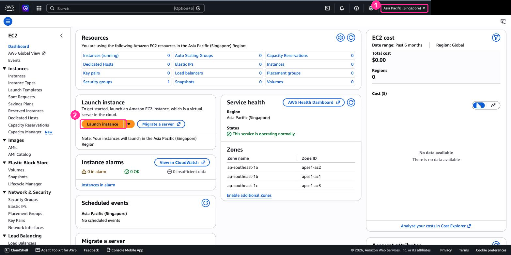
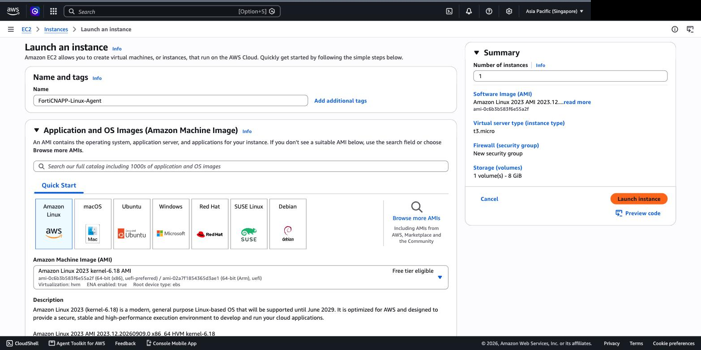
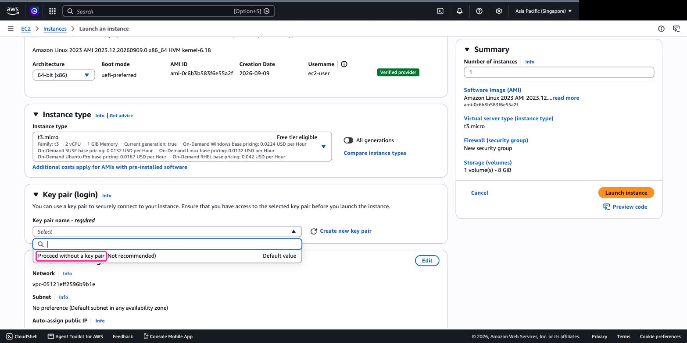
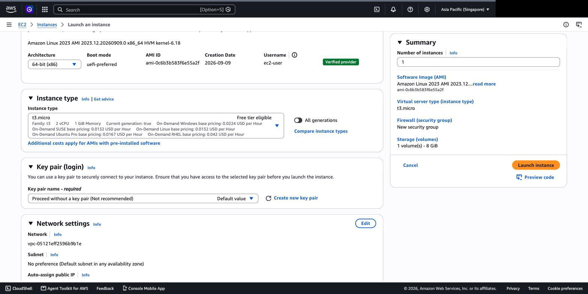
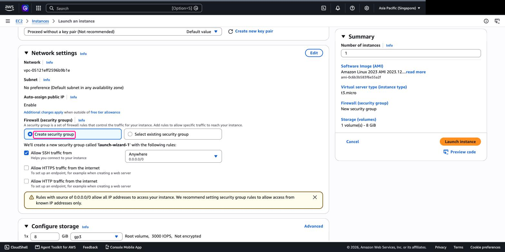
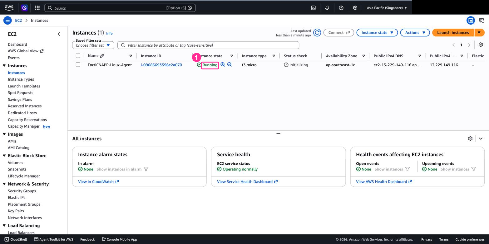
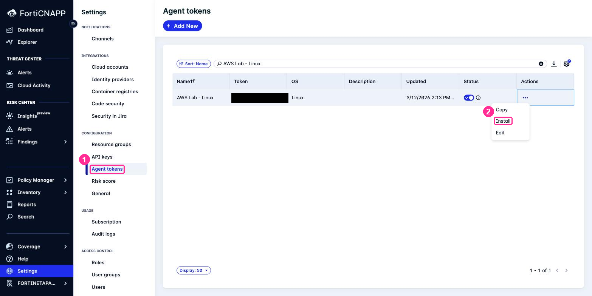

# Lab 4: Install Linux Agent

## Objectives

Agentless scanning (Lab 3) gives you periodic snapshots, but for deeper monitoring you need the agent. In this lab, we'll launch a Linux EC2 instance and install the FortiCNAPP agent (datacollector). Once running, it collects process, network, and file activity and sends it to FortiCNAPP every hour - this is how it builds behavioural baselines and detects anomalies.

## Prerequisites

- AWS account with EC2 launch permissions

## Lab Steps

### Step 1: Log into AWS Console

1. Navigate to <a href="https://aws.amazon.com/" target="_blank">https://aws.amazon.com/</a>
2. Click **Sign into console**
3. After logging in, change to your local region (e.g., **Asia Pacific (Singapore)**) using the region selector in the top right of the AWS Console

### Step 2: Create Linux EC2 Instance

1. Open the **EC2** service. Check the region selector reads **Asia Pacific (Singapore)**
   before you do anything else.



2. Click **Launch instance**.

3. **Name**: `FortiCNAPP-Linux-Agent`

4. **Application and OS Images**: leave **Amazon Linux 2023** selected. It is the default,
   and the agent installer does not care which distribution you pick.



5. **Instance type**: leave **t3.micro**.

6. **Key pair (login)**: open the dropdown and choose
   **Proceed without a key pair (Not recommended)**.

   You will connect through EC2 Instance Connect in the browser, which issues its own
   temporary key. There is nothing for you to download or keep.





7. **Network settings**: leave them alone. The wizard creates a security group called
   `launch-wizard-1` allowing SSH from anywhere, which is what Instance Connect needs.

   > **This is the step that breaks the lab.** Do not switch to **Select existing security
   > group** and pick the VPC's `default` group. That one only allows traffic between
   > resources that share it, so Instance Connect cannot reach your instance and you get a
   > timeout with no useful error.



8. **Configure storage**: leave the default, 8 GiB gp3.

9. Click **Launch instance**, then **View all instances**.

10. Wait for **Instance state** to read **Running**. Allow about a minute.



**Checkpoint:** one instance, state **Running**, and it has a public IPv4 address.

### Step 3: Get Agent Installation URL from FortiCNAPP

1. Log into FortiCNAPP console at <a href="https://partner-demo.lacework.net/" target="_blank">https://partner-demo.lacework.net/</a>
2. Ensure tenant is set to **FORTINETAPACDEMO**
3. Navigate to **Settings** > **Agent tokens**
4. Type `AWS Lab - Linux` in the search box. There are dozens of tokens on this tenant, so
   searching beats scrolling.
5. Click the **Actions** ellipsis (three dots) on that row, then **Install**



6. **Lacework Script** is already expanded. Click **Copy URL**.

   Copy the URL, not the script. The install command in the next step fetches it.


**Checkpoint:** you have a URL on your clipboard that starts with `https://`.

### Step 4: Connect to Linux EC2 Instance

1. Go to **EC2** > **Instances**.
2. Tick the checkbox next to `FortiCNAPP-Linux-Agent`.
3. Click **Connect** at the top of the page.
4. Stay on the **In web browser** tab and leave **EC2 Instance Connect** selected. It is the
   first of the four cards and it is already chosen.


5. Leave **Username** as `ec2-user`, then click **Connect**.

   A terminal opens in the browser. No key pair, no SSH client, nothing to install.
7. Once connected, verify system requirements:
   - Check available memory: `free -h`
   - Verify network connectivity: `ping -c 3 8.8.8.8`
   - Confirm sudo access: `sudo whoami`

### Step 5: Install Agent

In the EC2 Instance Connect terminal, run the following commands:

1. Download the installation script using the URL you copied in Step 3:
```bash
wget <paste-the-copied-url-here>
```

2. Make the script executable:
```bash
chmod +x install.sh
```

3. Execute the installation script:
```bash
sudo ./install.sh
```

The script will automatically install and configure the FortiCNAPP agent (datacollector) with the correct account and token.

### Step 6: Verify Agent Installation

1. Check the agent status using the datacollector binary:
```bash
sudo /var/lib/lacework/datacollector -status
```

This will return JSON output showing the agent status (e.g., `{"Version":2,"Datacollector":{"Status":"ACTIVE",...}}`). A status of "ACTIVE" indicates the agent is running and connected.

2. Check for agent logs:
```bash
ls -la /var/log/lacework/
```

3. Tail the agent log to see real-time activity:
```bash
sudo tail -f /var/log/lacework/datacollector.log
```
Press `Ctrl+C` to stop tailing the log.

### Step 7: Verify Agent in FortiCNAPP

Once the agent checks in (up to 1 hour), you can verify it appears in FortiCNAPP.

In the console, go to **Inventory** and look for the host by its instance ID.

If you took [Lab 6](../lab-06/README.md) and have the Lacework CLI configured in CloudShell, you can also check from the command line:

```bash
lacework agent list
```

Look for your Linux instance hostname in the output. If you don't see it yet, the agent hasn't completed its first check-in - try again later.

**Note:** The local `datacollector -status` check (Step 6) confirms the agent is running on the instance. The `lacework agent list` command confirms FortiCNAPP has received the agent's check-in.

## What did we do here?

We installed the FortiCNAPP agent (datacollector) on a Linux EC2 instance. The agent monitors the host - processes, network connections, file changes, user activity - and sends that data to FortiCNAPP every hour to build a behavioural baseline.

This is the agent-based approach to workload security. Unlike the agentless scanning from Lab 3 (which takes periodic snapshots), the agent collects data continuously and reports hourly. It's how FortiCNAPP detects anomalies like unexpected processes, suspicious network connections, or lateral movement.
