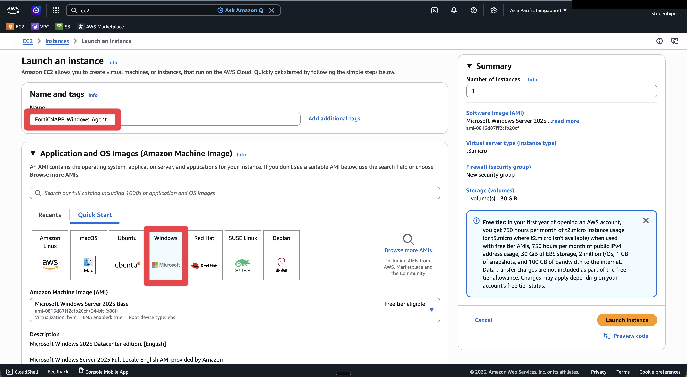
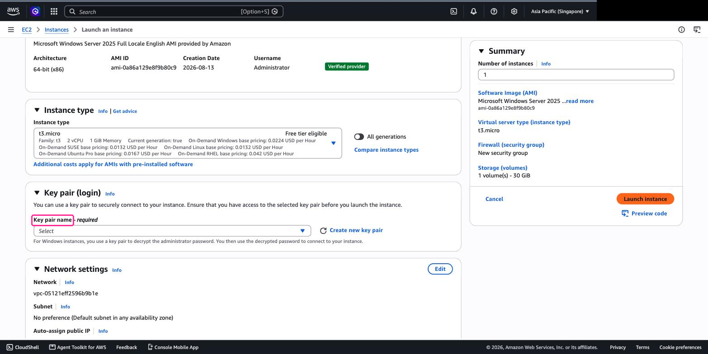
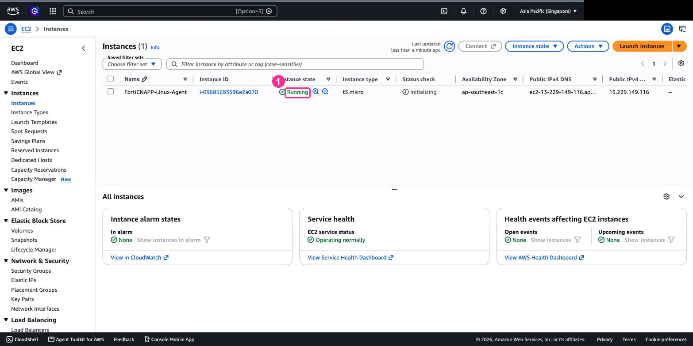
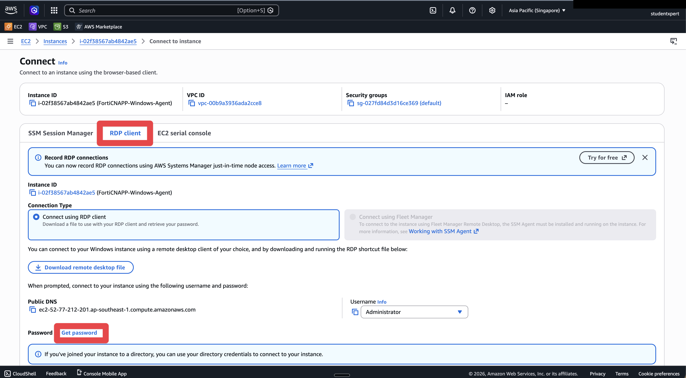
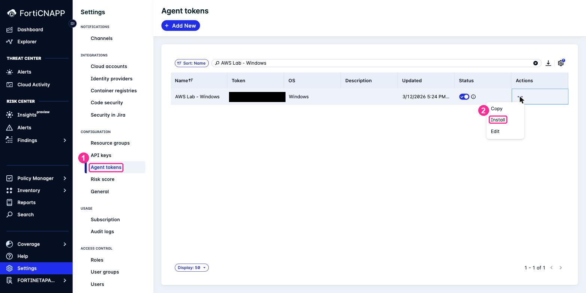
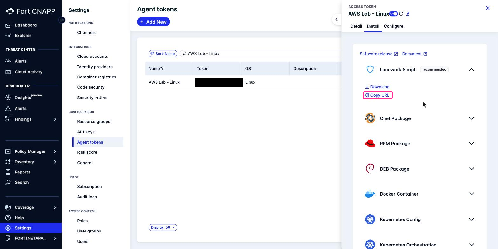

# Lab 5: Install Windows Agent

## Objectives

Same agent, same result, different road to get there. Almost every estate you will meet
runs both, so it is worth doing Windows once rather than assuming it follows.

| | Linux, Lab 4 | Windows, this lab |
|---|---|---|
| Get in | EC2 Instance Connect, in the browser | RDP, from your own machine |
| Credential | None | A key pair you download, to decrypt the Administrator password |
| Installer | One shell script | PowerShell script plus an MSI |
| You need | A URL | Two URLs and an access token |
| Runs as | `datacollector` | The `LWDataCollector` service |

## Prerequisites

- Completed [Lab 4](../lab-04/README.md)
- AWS account with permission to launch EC2 instances
- An RDP client: Remote Desktop Connection on Windows, **Windows App** on a Mac
- FortiCNAPP console access, tenant **FORTINETAPACDEMO**

## Lab Steps

### Step 1: Create Windows EC2 Instance

Same wizard as Lab 4. What differs: the image, and the key pair.

1. Open **EC2** and click **Launch instance**. Check the region still reads
   **Asia Pacific (Singapore)**.

2. **Name**: `FortiCNAPP-Windows-Agent`

3. **Application and OS Images**: click the **Windows** tile. The AMI becomes
   **Microsoft Windows Server 2025 Base**. Storage jumps to 30 GiB on its own.



4. **Instance type**: leave **t3.micro**.

5. **Key pair (login)**: this time you do need one.

   > **Windows is different from Lab 4.** There is no Instance Connect for Windows. AWS
   > encrypts the Administrator password with your public key, so without the private key
   > you cannot log in at all, and there is no way to recover it later.

   - Click **Create new key pair**
   - Name it `forticnapp-windows-key`, type **RSA**, format **.pem**
   - Click **Create key pair**. The `.pem` file downloads. Keep it, you need it in Step 3.



6. **Network settings**: leave them alone. The wizard creates a `launch-wizard-N` group
   allowing RDP from anywhere.

> [!WARNING]
> As in Lab 4, do not switch to **Select existing security group** and pick `default`.
> Your RDP client will not reach the instance.

7. **Configure storage**: leave the default, 30 GiB gp3.

8. Click **Launch instance**, then wait for **Instance state** to read **Running**.
   Windows takes longer to boot than Linux. Allow about four minutes before you try to
   fetch the password.



### Step 2: Get the Password and Connect

1. Go to **EC2** > **Instances**, tick your Windows instance, and click **Connect**.
2. Choose the **RDP client** tab.



3. Click **Get password**.
4. Upload the `.pem` file you downloaded in Step 1. AWS uses it to decrypt the password and
   shows it in the clear.
5. Copy the **Administrator password**.
6. Click **Download remote desktop file**.
7. Open that file:
   - **Windows**: double-click it
   - **Mac**: right-click and open with **Windows App**

   > **If it does not connect, turn off FortiSASE and try again.** FortiSASE blocks RDP by
   > default. So do most corporate VPN and secure-access agents. This is the commonest
   > reason this step fails, and it has nothing to do with AWS or the instance.

8. Username is `Administrator`, capital A. Paste the password.
9. A certificate warning is normal on an EC2 instance. Continue past it.

**Checkpoint:** you are looking at a Windows desktop in an RDP window.

#### If you cannot connect

Work down this list. The first two are far more common than anything else.

| Symptom | Cause and fix |
|---|---|
| Times out, or "couldn't connect to the remote PC" | Turn off FortiSASE or your VPN first, as above. If that was not it, outbound TCP 3389 is blocked somewhere else. Confirm with `Test-NetConnection -ComputerName <public-ip> -Port 3389`: `TcpTestSucceeded : False` is your answer. Conference WiFi, hotel WiFi and some ISPs block it too, and tethering to a phone is the quickest way round. |
| Password rejected | Windows may still be initialising. Wait and click **Get password** again. Check you used `Administrator`, capital A, and that the paste did not pick up a trailing space. |
| No password offered yet | The instance has not finished its first boot. Give it four minutes from **Running**. |

10. Once you are in, open **PowerShell as Administrator**: right-click **Start**, then
    **Terminal (Admin)** or **Windows PowerShell (Admin)**.

    Without **Administrator**, the installer fails partway and leaves no useful message.

### Step 3: Get the Install Details from FortiCNAPP

Do this in your **own** browser, not inside the RDP session.

1. In the FortiCNAPP console, confirm the tenant reads **FORTINETAPACDEMO**.
2. Go to **Settings** > **Configuration** > **Agent tokens**.
3. Search `AWS Lab - Windows`. Take care to pick the Windows token, not the Linux one from
   Lab 4.
4. Click the **Actions** ellipsis on that row, then **Install**.



5. The Windows panel offers different packages to the Linux one. You need three things from
   it:



| Take this | From | Used as |
|---|---|---|
| Script URL | **Lacework Powershell Script**, already expanded. **Copy URL** | what you download |
| MSI URL | Expand **MSI Package**, then its **Copy URL** | `-MSIURL` |
| Access token | Shown in the same panel | `-AccessToken` |

Paste all three somewhere you can get at them from inside the RDP session. RDP copy and
paste is unreliable, so a text file on the Windows desktop is easiest.

**Checkpoint:** three values, each one labelled so you know which is which.

### Step 4: Install the Agent

In the RDP session, in **PowerShell as Administrator**.

Download and unpack the script bundle:

```powershell
Invoke-WebRequest -Uri "<script-url>" -OutFile "install.zip"
Expand-Archive -Path "install.zip" -DestinationPath "install" -Force
cd install\signed-scripts
```

Then run it, substituting the access token and MSI URL from Step 3:

```powershell
.\Install-LWDataCollector.ps1 `
  -AccessToken "<access-token>" `
  -ServerURL "https://partner-demo.lacework.net" `
  -MSIURL "<msi-url>"
```

The script pulls the MSI, installs it, and registers the agent against your token. Nothing
to configure afterwards.

> **These URLs are easily swapped.** The script URL ends in `.zip`, the MSI URL in `.msi`. Give
> the installer them the wrong way round and it fails on a download error rather than
> telling you they are reversed.

### Step 5: Verify on the Host

The agent runs as a Windows service, so ask Windows:

```powershell
Get-Service -Name LWDataCollector
```

`Status` should read `Running`. To see where it lives and what it is writing:

```powershell
ls C:\ProgramData\Lacework\
ls C:\ProgramData\Lacework\Logs\
```

**Checkpoint:** `LWDataCollector` is `Running`.

### Step 6: Verify in FortiCNAPP

> **The agent reports hourly**, so it will not appear straight away. Carry on and come back.

In the console, go to **Inventory** and look for the host by its instance ID.

After [Lab 6](../lab-06/README.md) you can ask from CloudShell instead:

```bash
lacework agent list
```

Both your Linux and Windows hosts should be listed there by the end of the session.

## What did we do here?

The same agent, reached a harder way.

That is the useful part. A Windows estate is where agent rollout actually stalls,
and almost never because of the agent: it stalls on RDP being blocked, on a lost key pair,
on an installer run without Administrator. You have now hit those in a lab where it costs
nothing.

From here FortiCNAPP treats both hosts identically. The next labs move off hosts entirely
and look at the code that builds them.

---

Next: [Lab 6: Install the Lacework CLI](../lab-06/README.md).
