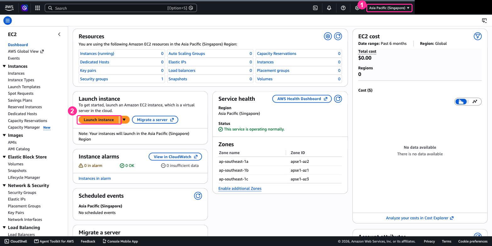
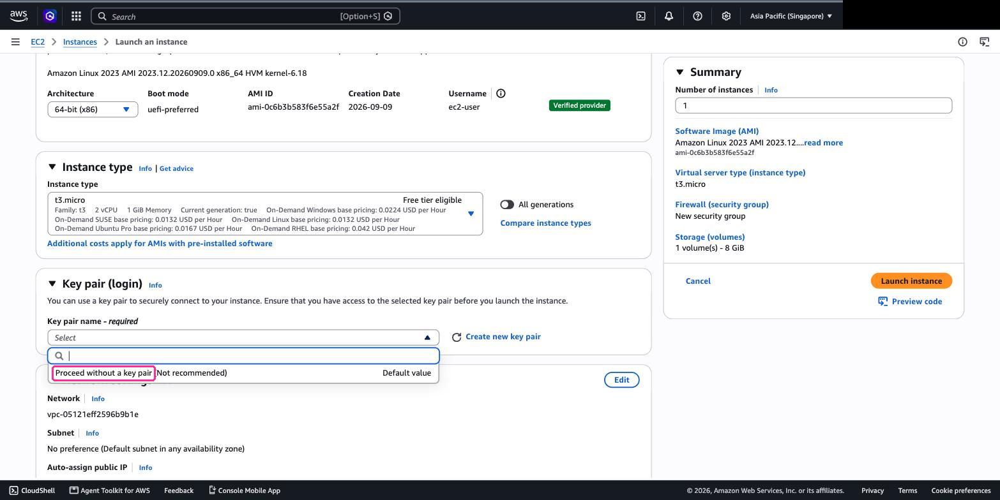
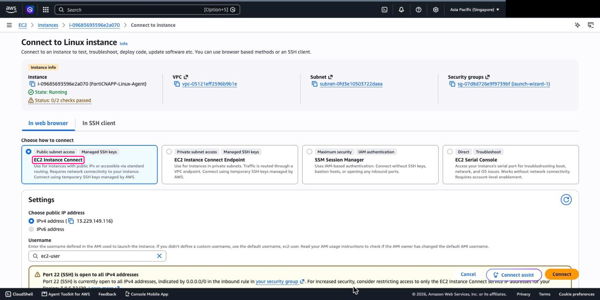
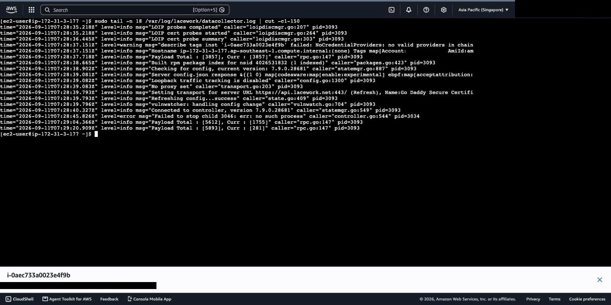

# Lab 5: Install Linux Agent

## Objectives

Lab 3 turned on agentless scanning. That reads your account from the outside: it takes a
snapshot of each disk, finds the packages and the secrets, and tells you what is
vulnerable. It never touches the running machine.

This lab installs the **agent**, which sits inside the machine and watches it work.

| | Agentless, Lab 3 | Agent, this lab |
|---|---|---|
| Where it runs | Outside, on a copy of the disk | On the host itself |
| What it sees | What is installed | What is actually happening: processes, connections, file changes, logins |
| How often | Periodic snapshot | Continuously, reporting hourly |
| To install | Nothing | One script |

Neither replaces the other. Agentless tells you a host **could** be exploited. The agent
tells you something **is** behaving strangely on it, which is what a baseline and an
anomaly alert are built from.

You will launch a Linux EC2 instance, install the agent on it, and confirm both ends agree
it is running.

## Prerequisites

- Completed [Lab 3](../lab-03/README.md)
- AWS account with permission to launch EC2 instances
- FortiCNAPP console access, tenant **FORTINETAPACDEMO**

## Lab Steps

### Step 1: Create Linux EC2 Instance

1. Open the **EC2** service. Check the region selector reads **Asia Pacific (Singapore)**
   before you do anything else.



2. Click **Launch instance**.

3. **Name**: `FortiCNAPP-Linux-Agent`

4. **Application and OS Images**: leave **Amazon Linux 2023** selected. It is the default,
   and the agent installer does not care which distribution you pick.


5. **Instance type**: leave **t3.micro**.

6. **Key pair (login)**: open the dropdown and choose
   **Proceed without a key pair (Not recommended)**.

   You will connect through EC2 Instance Connect in the browser, which issues its own
   temporary key. There is nothing for you to download or keep.




7. **Network settings**: leave them alone. The wizard creates a security group called
   `launch-wizard-1` allowing SSH from anywhere, which is what Instance Connect needs.


> [!WARNING]
> **This is the step that breaks the lab.** Do not switch to **Select existing security
> group** and pick the VPC's `default` group. That one only allows traffic between
> resources that share it, so Instance Connect cannot reach your instance and you get a
> timeout with no useful error.

8. **Configure storage**: leave the default, 8 GiB gp3.

9. Click **Launch instance**, then **View all instances**.

10. Wait for **Instance state** to read **Running**. Allow about a minute.


**Checkpoint:** one instance, state **Running**, and it has a public IPv4 address.

### Step 2: Get the Agent Install URL from FortiCNAPP

1. Log into FortiCNAPP console at <a href="https://partner-demo.lacework.net/" target="_blank">https://partner-demo.lacework.net/</a>
2. Ensure tenant is set to **FORTINETAPACDEMO**
3. Navigate to **Settings** > **Configuration** > **Agent tokens**
4. Type `AWS Lab - Linux` in the search box. There are dozens of tokens on this tenant, so
   searching beats scrolling.
5. Click the **Actions** ellipsis (three dots) on that row.


You need **two** things from this menu, and the clipboard holds one at a time. Take them in
this order, using each before you come back for the other.

6. Click **Install**. **Lacework Script** is already expanded, so click **Copy URL**.

   Copy the URL, not the script. The install command in the next step fetches it.


**Checkpoint:** you have a URL on your clipboard that starts with `https://`.

### Step 3: Connect to the Instance

1. Go to **EC2** > **Instances**.
2. Tick the checkbox next to `FortiCNAPP-Linux-Agent`.
3. Click **Connect** at the top of the page.
4. Stay on the **In web browser** tab and leave **EC2 Instance Connect** selected. It is the
   first of the four cards and it is already chosen.



5. Leave **Username** as `ec2-user`, then click **Connect**.

   A terminal opens in the browser. No key pair, no SSH client, nothing to install.

6. Confirm the shell can do what the installer needs:

```bash
sudo whoami        # must print: root
ping -c 3 8.8.8.8  # the agent needs to reach the internet
```

**Checkpoint:** `sudo whoami` prints `root` and the pings come back.

### Step 4: Install the Agent

In the EC2 Instance Connect terminal, run the following commands:

Paste the URL from Step 2 where shown. Keep the `-O install.sh`, which names the
downloaded file for you rather than trusting whatever the URL ends in.

```bash
wget -O install.sh "<paste-the-copied-url-here>"
chmod +x install.sh
sudo ./install.sh
```

The script checks connectivity, then stops and asks:

```
Please enter access token:
```

That is the second thing you need from the Actions menu, and it is **not** the URL you just
used. Go back to FortiCNAPP, click the **Actions** ellipsis on the same token, and choose
**Copy**. That puts the 56-character agent token on your clipboard. Paste it at the prompt
and press Enter.

> [!CAUTION]
> The token echoes on screen in the clear. Take care if you are sharing your screen.

The rest runs on its own: it downloads the agent package, installs it, and registers with
FortiCNAPP using that token. It ends with `Lacework successfully installed`.

> [!TIP]
> **Pasting into the browser terminal.** Use **Ctrl+V** (**Cmd+V** on a Mac). If the paste
> arrives empty, your clipboard did not survive the tab switch. Go back and copy again.

### Step 5: Verify on the Host

Ask the agent how it is doing:

```bash
sudo /var/lib/lacework/datacollector -status
```

It answers in JSON. The field that matters is `Status`:

```json
{"Version":2,"Datacollector":{"Status":"ACTIVE", ...}}
```

`ACTIVE` means it is running and talking to FortiCNAPP.

**Checkpoint:** `Status` reads `ACTIVE`.

### Look at what it is logging

```bash
sudo tail -f /var/log/lacework/datacollector.log
```

`Ctrl+C` stops the tail. The file is readable by `root` only, so the `sudo` matters.



Three lines are worth finding:

| Line | Means |
|---|---|
| `Setting transport for server URL https://api.lacework.net:443/` | Where it sends data |
| `Connected to controller, version 7.9.0.28681` | It registered successfully |
| `Payload Total : [5612], Curr : [1755]` | Data leaving the host, every 15 to 20 seconds |

Watch for a minute and the `Payload` line repeats. That is your agent reporting.

> [!NOTE]
> **This log is the agent talking about itself, not a feed of what it sees.** The processes,
> connections and file changes go to FortiCNAPP, not to this file. What the log proves is
> that the pipe is open.

Two lines look alarming and are not:

- `level=warning ... describe tags ... NoCredentialProviders` means the instance has no IAM
  role, which it does not need
- `level=error msg="Failed to stop child ... no such process"` is startup noise

### Step 6: Verify in FortiCNAPP

> **The agent reports hourly, so it will not appear straight away.** That is expected, not a
> failure. Carry on to Lab 6 and come back to this step later in the session.

In the console, go to **Inventory** and look for the host by its instance ID.

Once you have done [Lab 7](../lab-07/README.md) you can ask the same question from
CloudShell instead:

```bash
lacework agent list
```

Look for your instance hostname. Nothing there yet means the first check-in has not landed.

> **The two checks answer different questions.** `datacollector -status` on the host says
> the agent is running. `lacework agent list` says FortiCNAPP has heard from it. You can
> have the first without the second. That gap is almost always a security group or a route,
> not the agent.

## What did we do here?

The host now reports what it is doing, not just what is installed on it.

That is the whole difference. Agentless found the vulnerable package. The agent is what
notices the package being exploited: a process that has never run before, a connection to
somewhere this host has never talked to, a login at the wrong hour. You cannot alert on
behaviour you are not watching.

The Windows install differs enough to be worth doing once.

---

Next: [Lab 6: Install Windows Agent](../lab-06/README.md).
