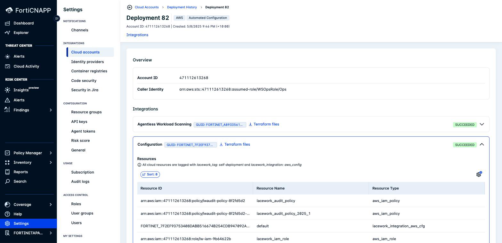
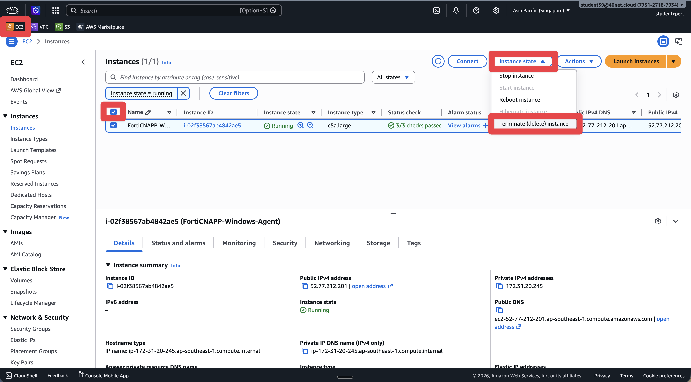

# Lab 6: Clean Up Workshop Resources

## Objectives

Leaving workshop resources running in AWS costs money. In this lab, we'll remove
everything the workshop created: the integrations from Lab 3, the resources they built in
AWS, and the EC2 instances from Labs 4 and 5.

There are two ways to do it. Read both before you start.

| Route | Needs | Removes both sides? |
|---|---|---|
| **A. Console and tag search** | Nothing. A browser. | No. Two separate jobs, done by hand. |
| **B. Terraform destroy** | Terraform, from [Lab 8](../lab-08/README.md) | **Yes. One command per integration.** |

**Route A is the main path** because it needs no tooling and everyone can follow it. Take
**Route B if you did Lab 8**, because it is the only way to remove the AWS resources and
the FortiCNAPP integration in a single operation.

## Prerequisites

- Access to the AWS Console
- FortiCNAPP console access, tenant **FORTINETAPACDEMO**

## First, find what was created

Whichever route you take, start here.

1. Go to **Settings** > **Integrations** > **Cloud accounts**.
2. Select the **Deployment History** tab.
3. Open the deployment you created in Lab 3.
4. Expand each integration to see its **Resources** table.



Each integration lists every resource by ARN, name and type, and states the exact tags
applied, for example:

> All cloud resources are tagged with `lacework_tag: self-deployment` and
> `lacework_integration: aws_config`

> **Read the tag values from this screen, and search on the tag key.** The values are not
> stable. The administration guide documents `lacework_tag: self-deployment` and
> `lacework_integration: configuration`. A 2026 deployment record shows
> `lacework_integration: aws_config`. Resources deployed in March 2025 carry
> `lacework_tag: lacework-self-deploy`. All three are real, seen in the same tenant.
>
> Search on the key `lacework_tag` with any value. Filter on a value and you will miss
> resources and leave them running.

Keep this page open. It is your checklist either way.

---

## Route A: Console and tag search

No tooling required. Two jobs, because deleting the integration does not touch AWS.

### Step 1: Delete the Integrations in FortiCNAPP

1. Go to **Settings** > **Integrations** > **Cloud accounts**.
2. Select the **Cloud Accounts** tab.
3. Find your AWS account ID in the list.
4. Delete each integration on that account: Configuration, CloudTrail and Agentless.

### Step 2: Delete the AWS Resources by Tag

1. Log into the AWS Console.
2. Select the region you used in Lab 3.
3. Go to **Resource Groups & Tag Editor** > **Tag Editor**.
4. Set **Regions** to your workshop region, or **All regions** to be thorough.
5. Set **Resource types** to **All supported resource types**.
6. Add this tag filter:
   - **Tag key**: `lacework_tag`
   - **Tag value**: leave empty, so the search matches every value
7. Click **Search resources**.

Work through the result and delete each resource, cross-checking the deployment record.
Expect IAM roles and policies, S3 buckets, KMS keys, SNS topics, SQS queues, a CloudTrail
trail, an ECS cluster and Lambda functions.

Agentless scanning also tags its networking `LWTAG_LACEWORK_AGENTLESS`, which the
`lacework_tag` search does **not** return. Run a second search on that key to catch the
VPC, subnet, route table, internet gateway and security group in every scanned region.

> **Order matters.** Empty an S3 bucket before deleting it. Delete resources that depend on
> an IAM role before the role. A KMS key can only be scheduled for deletion, minimum seven
> days.

---

## Route B: Terraform destroy

Better, and the only route that removes both sides at once. The bundle FortiCNAPP gives you
contains **full Terraform state**, including the FortiCNAPP integration itself, so
`terraform destroy` deregisters the integration and deletes the AWS resources in one pass.

You need Terraform. CloudShell does not ship it, so complete [Lab 8](../lab-08/README.md)
first, or install it now.

### Step 1: Download the Terraform bundle

On the deployment record, click **Terraform files** next to an integration. Repeat for each
integration; **the bundle is per integration**, so three integrations means three bundles.

> **You cannot `curl` this URL.** It is authenticated by your browser session, not by an
> API token. Fetching it without a browser returns `401` and an HTML login page. Download
> it in the browser, then upload it to CloudShell.

### Step 2: Upload it to CloudShell

1. Open CloudShell.
2. Choose **Actions** > **Upload file**.
3. Select the `tf-files.tar.gz` you just downloaded.

### Step 3: Destroy

Get fresh credentials the same way you did in [Lab 2](../lab-02/README.md), then:

```bash
mkdir -p ct && tar -xzf tf-files.tar.gz -C ct && cd ct

terraform init

terraform plan -destroy \
  -var access_key="$AK" -var secret_key="$SK" -var token="$ST"

terraform destroy \
  -var access_key="$AK" -var secret_key="$SK" -var token="$ST"
```

Read the plan before you apply it. It should list the AWS resources **and** a
`lacework_integration_*` resource. That last one is the integration record, and it is why
this route cannot leave an orphan.

Repeat for each bundle. A full three-integration teardown took about four minutes in
testing, most of it the agentless VPC and ECS cluster. Terraform prints `Still
destroying...` every ten seconds, so it is working, not stuck.

For reference, a full run on one account destroyed:

| Bundle | Resources |
|---|---|
| Agentless | 41 |
| CloudTrail | 29 |
| Configuration | 19 |

---

## Terminate the EC2 Instances

Both routes need this. The agents in Labs 4 and 5 run on instances the integrations do not
own.

1. Go to the **EC2** service.
2. Find the instance from Lab 4, for example `FortiCNAPP-Linux-Agent`.
3. Select it, then **Instance state** > **Terminate instance**. Confirm.
4. Repeat for the Lab 5 Windows instance.



## Verify

1. In FortiCNAPP, confirm your AWS account no longer appears under **Cloud accounts**.
2. Confirm both EC2 instances show **terminated**.
3. In AWS, check that nothing is still running:

```bash
aws cloudtrail describe-trails --query "trailList[].Name" --output text
aws ecs list-clusters --query clusterArns --output text
aws events list-rules --query "Rules[?contains(Name,'lacework')].[Name,State]" --output text
aws s3api list-buckets --query "Buckets[?contains(Name,'lacework')].Name" --output text
```

All four should come back empty. The EventBridge one matters most, because that is the
hourly trigger.

### A tag search will still return a few resources, and that is normal

Re-run the Tag Editor search and you may still see four or five entries. Check their state
before chasing them:

| Resource | Expected state after cleanup |
|---|---|
| KMS key | `PendingDeletion`, scheduled 7 to 30 days out. AWS does not delete keys immediately. |
| Secrets Manager secret | Deleted, inside its recovery window |
| ECS cluster | `INACTIVE` |
| ECS task definition | `INACTIVE`. Deregistered task definitions stay in the account permanently. |
| Security group, subnet, VPC | Often already gone. The tag index lags. |

```bash
aws kms describe-key --key-id <key-id> --query 'KeyMetadata.[KeyState,DeletionDate]' --output text
aws ecs describe-clusters --clusters <name> --query 'clusters[0].status' --output text
```

None of these are running or scanning. The one to watch is the KMS key, which carries a
small monthly charge until its deletion date passes.

## Why this lab matters more than it looks

Orphaned agentless infrastructure keeps running.

The agentless scanner is driven by an **EventBridge rule on an hourly schedule**. Deleting
the integration in FortiCNAPP does not delete that rule. It keeps firing, keeps starting an
ECS task, and keeps costing money, while reporting to an integration that no longer exists.

We found exactly this in a real Fortinet demo account: an agentless deployment from March
2025 still running `rate(1 hour)` in September 2026, pointing at an integration GUID that
had been deleted from the tenant. Nothing in the FortiCNAPP console showed it, because there
was no integration left to show.

Orphaned storage grows quietly too. The CloudTrail bucket left behind by that same
deployment held **816,721 objects** by the time we emptied it, eighteen months of logs
nobody was reading.

Check the EventBridge rule in every region you scanned:

```bash
aws events list-rules --region <region> \
  --query "Rules[?contains(Name,'lacework')].[Name,State,ScheduleExpression]" --output text
```

## What did we do here?

We removed both sides of the workshop: the integration records in FortiCNAPP and the
resources in AWS.

Route A teaches you where the seams are. FortiCNAPP creates the integration record, and
Terraform creates the AWS resources, and the console only deletes the first of those. That
is the gap orphaned resources fall through.

Route B closes the gap, because the state file spans both. Worth knowing for a customer:
the Terraform bundle on the deployment record is a complete workspace, state included, so
`terraform destroy` does the whole job in one command.
