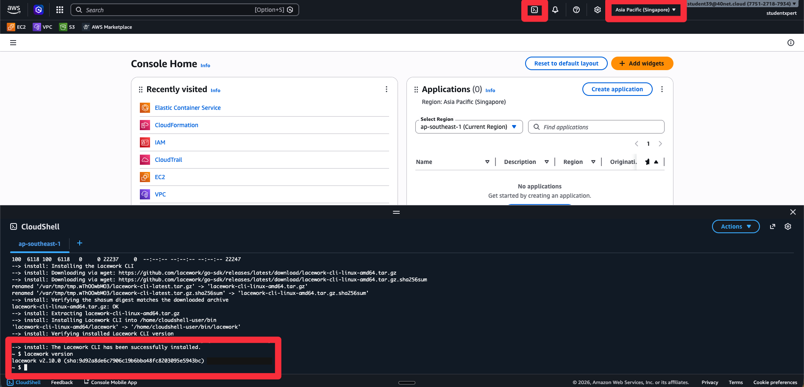
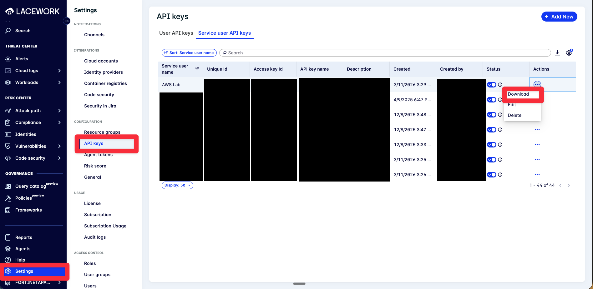

# Lab 6: Install the Lacework CLI

## Objectives

Everything so far has been the console. The CLI is the same platform through a different
door, and it is the door you use when you want to script something, check twenty accounts
at once, or answer a question the console has no page for.

You will install it in **AWS CloudShell**, so there is nothing to install on your own
machine and nothing to uninstall afterwards.

Labs 7 and 8 need this CLI, so this lab is not optional if you are continuing.

## Prerequisites

- Completed [Lab 3](../lab-03/README.md), so there are integrations to list
- FortiCNAPP console access, tenant **FORTINETAPACDEMO**

## Lab Steps

### Step 1: Open CloudShell

1. In the AWS console, check the region reads **Asia Pacific (Singapore)**.
2. Click the **CloudShell** icon in the top bar, the cloud with `>_` in it. It also sits at
   the bottom left of the console.
3. Wait for the prompt. First launch takes a minute.

> **CloudShell is a free Linux shell with your console credentials already loaded.** Nothing
> to install, nothing to authenticate. It is wiped after long inactivity, apart from your
> home directory, which is why the next step installs into `$HOME/bin`.

### Step 2: Install the CLI

Make a `bin` directory in your home folder and put it on your PATH, so the CLI survives a
CloudShell restart:

```bash
mkdir -p "$HOME/bin"
echo 'export PATH=$HOME/bin:$PATH' >> ~/.bashrc
source ~/.bashrc
```

Then install:

```bash
curl https://raw.githubusercontent.com/lacework/go-sdk/main/cli/install.sh | bash -s -- -d "$HOME/bin"
lacework version
```



**Checkpoint:** `lacework version` prints a version instead of `command not found`.

### Step 3: Download the API Key

An existing service user **AWS Lab** has been pre-configured with the necessary permissions. Download the API key for this user:

1. Log into FortiCNAPP console at <a href="https://partner-demo.lacework.net/" target="_blank">https://partner-demo.lacework.net/</a>
2. Ensure tenant is set to **FORTINETAPACDEMO**
3. Navigate to **Settings** > **Configuration** > **API keys**
4. Click the **Service user API keys** tab. The **User API keys** tab next to it is a
   different thing, and its keys will not work here.
5. Type `AWS Lab` in the search box
6. Click the ellipsis (three dots) on that row, then **Download**. The key arrives as JSON.



7. Open the JSON file. You need four values from it.

> **This file is a live credential.** It can read your tenant. Do not paste it into chat,
> a shared document, or a ticket, and delete it when the workshop ends. Lab 9 revokes the
> key itself.

### Step 4: Point the CLI at FortiCNAPP

```bash
lacework configure
```

It asks four questions. The answers all come from that JSON file, which looks like this:

```json
{
  "keyId": "FORTINET_XXXXXXXXXXXXXXXX",
  "secret": "_xxxxxxxxxxxxxxxxxxxxxxx",
  "account": "partner-demo.lacework.net",
  "subAccount": "fortinetapacdemo"
}
```

| It asks for | Use the JSON field |
|---|---|
| Account | `account` |
| API Key | `keyId` |
| API Secret | `secret` |
| Sub-Account | `subAccount` |

The **sub-account** is the one people miss. It is the tenant, `fortinetapacdemo`. Leave it
blank and the CLI talks to the wrong place and shows you nothing.

### Step 5: List Your Integrations

```bash
lacework version
lacework cloud-account list
```

The integration types have internal names, which is the first thing the CLI shows you that
the console hides:

| CLI name | What you selected in Lab 3 |
|---|---|
| `AwsCfg` | Configuration |
| `AwsCtSqs` | CloudTrail |
| `AwsSidekick` | Agentless Workload Scanning |

`AwsCtSqs` appears only if CloudTrail deployed. Accounts inside an AWS Organization that
already has an organization trail cannot deploy it. See the troubleshooting section in
[Lab 3](../lab-03/README.md).

**Checkpoint:** your AWS account number appears, with at least `AwsCfg` and `AwsSidekick`.

### Step 6: Trigger an Inventory Scan

FortiCNAPP collects resource inventory on its own cycle, up to 24 hours. The CLI can ask
for one now:

```bash
lacework compliance aws scan
```

> **Your instructor runs this one, once. Do not all run it.**
>
> Three things make this command behave unlike the rest of the lab:
>
> - it is **tenant-wide**. There is no per-account form of it, so one person's scan covers
>   every account integrated into this tenant, yours included
> - **only one scan runs at a time.** While one is going, every other request is silently
>   ignored. No error, no queue position, nothing
> - it takes **one to two hours**
>
> In a room this size that means one scan happens and everyone benefits. Forty of you
> typing it changes nothing.

So treat this as something you have now **seen**, and will use on a customer tenant where
you are the only one driving. Do not expect fresh compliance data to land before the
session ends.

**Checkpoint:** you understand why this is the one command in the workshop you should not
all run at once.

## What did we do here?

We swapped the console for a terminal, against the same platform and the same data.

That matters more than it sounds. Everything you have done by clicking is an API call, and
once you can make those calls yourself you can check twenty accounts as easily as one, put
onboarding into a pipeline, and answer questions that have no console page. Labs 7 and 8
take that straight into source code.

The scan command is also a fair warning about shared tenants. Some operations are
tenant-wide and serialised, and they do not tell you when they are ignoring you.
