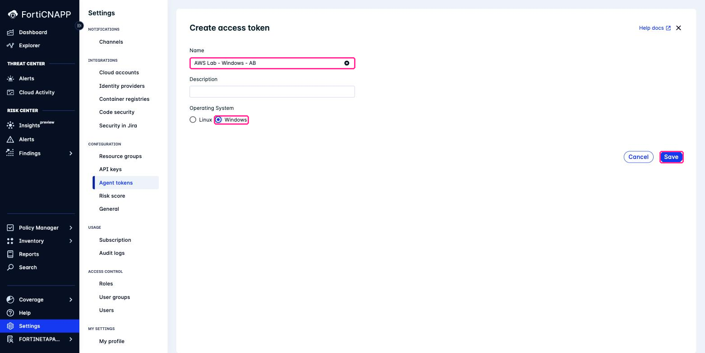
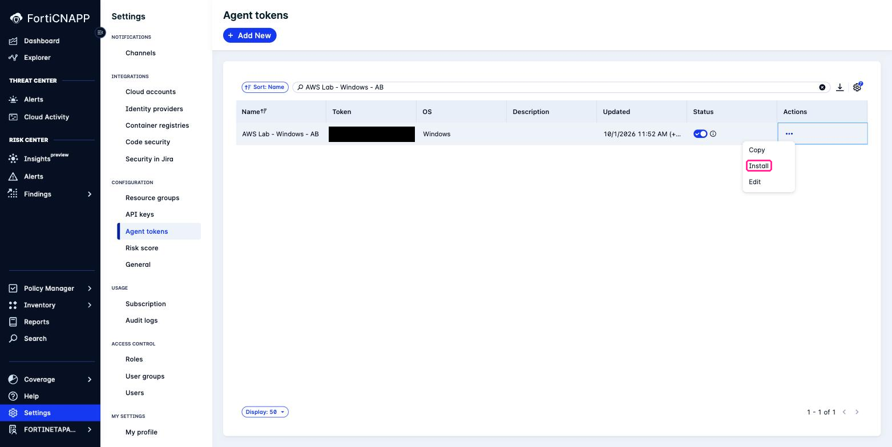
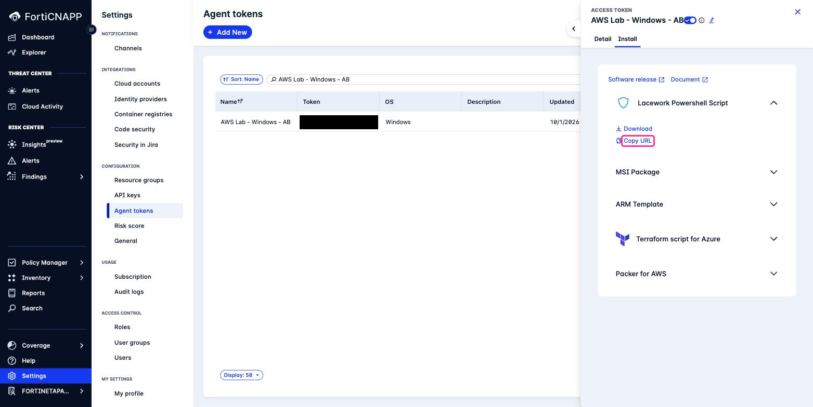
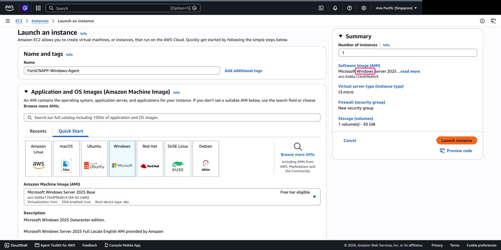
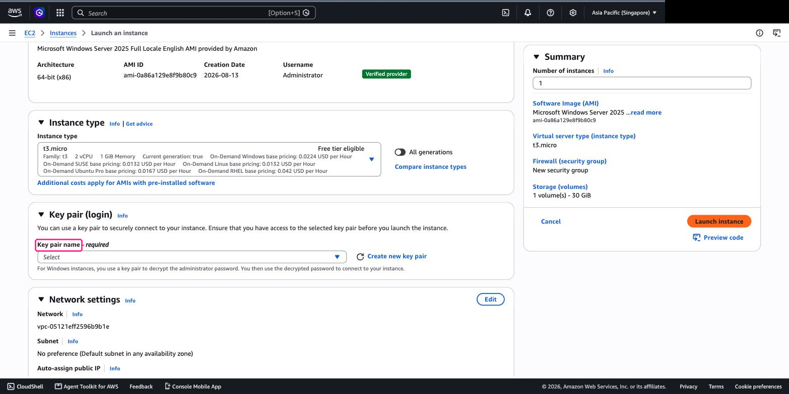
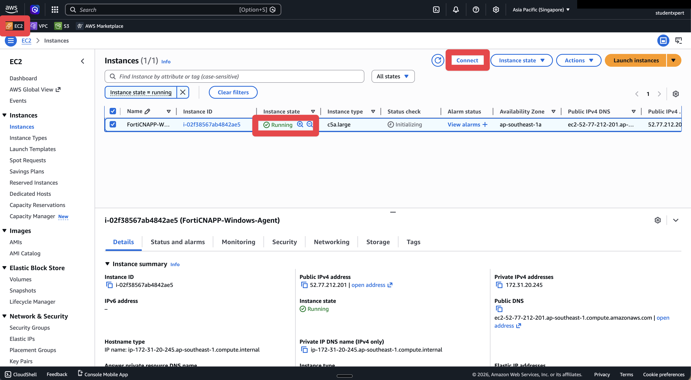
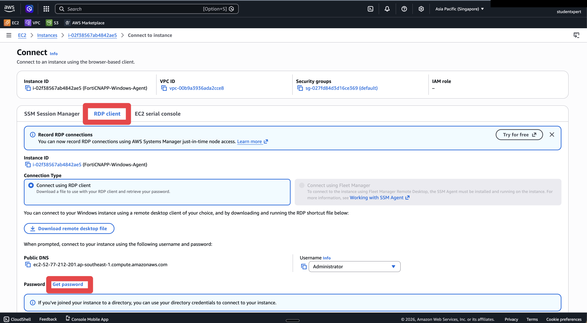
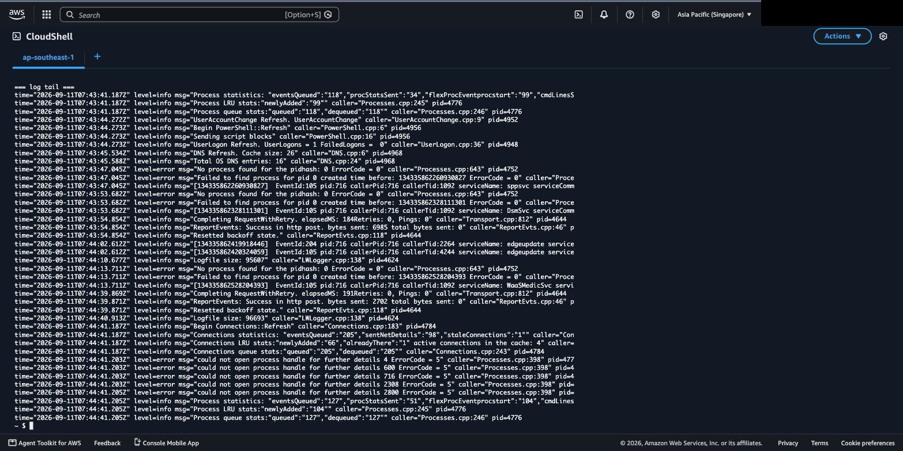

# Lab 6: Install Windows Agent

## Objectives

Same agent, same result, different road to get there. Almost every estate you will meet
runs both, so it is worth seeing Windows once rather than assuming it follows.

| | Linux, Lab 5 | Windows, this lab |
|---|---|---|
| Get in | EC2 Instance Connect, in the browser | RDP, from your own machine |
| Credential | None | A key pair you download, to decrypt the Administrator password |
| Installer | One shell script | PowerShell script plus an MSI |
| You need | A URL | Two URLs and an access token |
| Runs as | `datacollector` | The `LWDataCollector` service |

The lab has two parts:

- **Part 1, everyone.** Create your own Windows agent token and build the install command
  from it. In Lab 5 you used a token someone made for you. This time you make it.
- **Part 2, optional.** Launch a Windows instance and run that command over RDP. RDP is
  slow from a room full of laptops, so you can read this part and skip to Lab 7.

## Prerequisites

- Completed [Lab 5](../lab-05/README.md)
- FortiCNAPP console access, tenant **FORTINETAPACDEMO**
- For Part 2 only:
  - AWS account with permission to launch EC2 instances
  - An RDP client: Remote Desktop Connection on Windows, **Windows App** on a Mac

## Part 1: Create a Token and Build the Install Command

### Step 1: Create a Windows Agent Token

An agent token is the credential that joins an agent to this tenant. Anyone who holds it
can register a host here, so treat it as a secret.

1. In the FortiCNAPP console, confirm the tenant reads **FORTINETAPACDEMO**.
2. Go to **Settings** > **Configuration** > **Agent tokens**, and click **Add New**.
3. **Name**: `AWS Lab - Windows - <your initials>`
4. **Operating System**: select **Windows**. Linux is selected by default.
5. Click **Save**.



> [!IMPORTANT]
> **Put your initials in the name.** Everyone in the room makes a token in this step, on a
> tenant that already holds dozens. Without your initials you cannot tell yours apart.

**Checkpoint:** the console shows **Token is created**, and your token is in the list with
OS **Windows**.

### Step 2: Open the Install Panel

1. Type your token's name in the search box.
2. Click the **Actions** ellipsis on your row, then **Install**.



### Step 3: Collect the Three Install Values

The Windows panel offers different packages to the Linux one. You need three things from
it:



| Take this | From | Used as |
|---|---|---|
| Script URL | **Install** tab. **Lacework Powershell Script**, already expanded. **Copy URL** | what you download |
| MSI URL | **Install** tab. Expand **MSI Package**, then its **Copy URL** | `-MSIURL` |
| Access token | **Detail** tab, the **Token** field | `-AccessToken` |

> **The package sections are an accordion.** Expanding **MSI Package** collapses
> **Lacework Powershell Script**. Take the script URL first, paste it somewhere, then come
> back for the MSI one.

Paste all three into a text file on your own machine, each one labelled.

**Checkpoint:** three values, each one labelled so you know which is which.

### Step 4: Build the Install Command

The install runs in two parts. The first downloads and unpacks the script bundle:

```powershell
Invoke-WebRequest -Uri "<script-url>" -OutFile "install.zip"
Expand-Archive -Path "install.zip" -DestinationPath "install" -Force
cd install\signed-scripts
```

The second runs the installer with your token and the MSI URL:

```powershell
.\Install-LWDataCollector.ps1 `
  -AccessToken "<access-token>" `
  -ServerURL "https://partner-demo.lacework.net" `
  -MSIURL "<msi-url>"
```

Copy both blocks into your text file and replace each placeholder with its value from
Step 3.

> **These URLs are easily swapped.** The script URL ends in `.zip`, the MSI URL in `.msi`.
> Give the installer them the wrong way round and it fails on a download error rather than
> telling you they are reversed.

The script pulls the MSI, installs it, and registers the agent against your token. Nothing
to configure afterwards.

**Checkpoint:** both blocks are in your text file, with no angle brackets left.

## Part 2 (Optional): Install on a Windows Instance

Part 2 launches a Windows instance and runs your command on it over RDP. Windows boots
slowly, and RDP is slow on shared WiFi.

**To skip it**, read the steps below so you know how the install goes, especially
[Look at what it is logging](#look-at-what-it-is-logging). Then go to
[Lab 7](../lab-07/README.md).

### Step 1: Create Windows EC2 Instance

Same wizard as Lab 5. What differs: the image, and the key pair.

1. Open **EC2** and click **Launch instance**. Check the region still reads
   **Asia Pacific (Singapore)**.

2. **Name**: `FortiCNAPP-Windows-Agent`

3. **Application and OS Images**: click the **Windows** tile. The AMI becomes
   **Microsoft Windows Server 2025 Base**. Storage jumps to 30 GiB on its own.



4. **Instance type**: leave **t3.micro**.

5. **Key pair (login)**: this time you do need one.

   > **Windows is different from Lab 5.** There is no Instance Connect for Windows. AWS
   > encrypts the Administrator password with your public key, so without the private key
   > you cannot log in at all, and there is no way to recover it later.

   - Click **Create new key pair**
   - Name it `forticnapp-windows-key-<your initials>`, type **RSA**, format **.pem**
   - Click **Create key pair**. The `.pem` file downloads. Keep it, you need it in Step 2.

> [!IMPORTANT]
> **Put your initials in the name.** Key pair names are unique per region, so if anyone has
> run this workshop in this account before, a plain `forticnapp-windows-key` fails with
> `InvalidKeyPair.Duplicate`. You cannot reuse the old one either, because its private key
> was only ever downloadable once.



6. **Network settings**: leave them alone. The wizard creates a `launch-wizard-N` group
   allowing RDP from anywhere.

> [!WARNING]
> As in Lab 5, do not switch to **Select existing security group** and pick `default`.
> Your RDP client will not reach the instance.

7. **Configure storage**: leave the default, 30 GiB gp3.

8. Click **Launch instance**, then wait for **Instance state** to read **Running**.
   Windows takes longer to boot than Linux. Allow about four minutes before you try to
   fetch the password.



### Step 2: Get the Password and Connect

1. Go to **EC2** > **Instances**, tick your Windows instance, and click **Connect**.
2. Choose the **RDP client** tab.



3. Click **Get password**.
4. Upload the `.pem` file you downloaded in Step 1. AWS uses it to decrypt the password and
   shows it in the clear.
5. Copy the **Administrator password**.
6. Click **Download remote desktop file**.
7. Open that file:
   - **Windows**: double-click it
   - **Mac**: right-click and open with **Windows App**

   > **If it does not connect, turn off FortiSASE and try again.** FortiSASE blocks RDP by
   > default. So do most corporate VPN and secure-access agents. This is the commonest
   > reason this step fails, and it has nothing to do with AWS or the instance.

8. Username is `Administrator`, capital A. Paste the password.
9. A certificate warning is normal on an EC2 instance. Continue past it.

**Checkpoint:** you are looking at a Windows desktop in an RDP window.

#### If you cannot connect

Work down this list. The first two are far more common than anything else.

| Symptom | Cause and fix |
|---|---|
| Times out, or "couldn't connect to the remote PC" | Turn off FortiSASE or your VPN first, as above. If that was not it, outbound TCP 3389 is blocked somewhere else. Confirm with `Test-NetConnection -ComputerName <public-ip> -Port 3389`: `TcpTestSucceeded : False` is your answer. Conference WiFi, hotel WiFi and some ISPs block it too, and tethering to a phone is the quickest way round. |
| Password rejected | Windows may still be initialising. Wait and click **Get password** again. Check you used `Administrator`, capital A, and that the paste did not pick up a trailing space. |
| No password offered yet | The instance has not finished its first boot. Give it four minutes from **Running**. |

10. Once you are in, open **PowerShell as Administrator**: right-click **Start**, then
    **Terminal (Admin)** or **Windows PowerShell (Admin)**.

    Without **Administrator**, the installer fails partway and leaves no useful message.

11. Open **Notepad** on the Windows desktop and paste in your text file from Part 1. RDP
    copy and paste is unreliable, so move everything across in one go, not value by value.

### Step 3: Install the Agent

In **PowerShell as Administrator**, run the two blocks you built in Part 1, Step 4. Run the
download block first, then the installer.

### Step 4: Verify on the Host

The agent runs as a Windows service, so ask Windows:

```powershell
Get-Service -Name LWDataCollector
```

`Status` should read `Running`.

```powershell
ls C:\ProgramData\Lacework\
ls C:\ProgramData\Lacework\Logs\
```

**Checkpoint:** `LWDataCollector` is `Running`.

### Look at what it is logging

```powershell
Get-Content C:\ProgramData\Lacework\Logs\LWDataCollector_0.log -Tail 40 -Wait
```

`Ctrl+C` stops it.



**This is worth more of your time than the Linux one.** The Windows agent writes what it is
observing, not just that it is connected:

| Line | What it is watching |
|---|---|
| `Process statistics: eventsQueued 118, procStatsSent 34` | Processes starting and stopping |
| `Connections statistics: eventsQueued 205, sentNetDetails 98` | Network connections |
| `UserLogon Refresh. UserLogons = 1 FailedLogons = 0` | Who logged in, and who failed |
| `DNS Refresh. Cache size: 26` | Name lookups the host made |
| `Begin PowerShell::Refresh` / `Sending script blocks` | PowerShell being run |
| `ReportEvents: Success in http post. bytes sent: 6985` | All of it going to FortiCNAPP |

Read that list again. Processes, connections, logons, DNS and PowerShell, from one host,
continuously. **That is the polygraph from [Lab 1](../lab-01/README.md), on a machine you
built twenty minutes ago.** It is also why a composite alert can exist: no single line
there is suspicious, and the combination can be.

Plenty of lines say `level=error` and are routine:

- `No process found for the pidhash: 0` and `Failed to find process for pid 0`
- `could not open process handle for further details ... ErrorCode = 5`, which is Windows
  refusing access to protected system processes

### Step 5: Verify in FortiCNAPP

> **The agent reports hourly**, so it will not appear straight away. Carry on and come back.

In the console, go to **Inventory** and look for the host by its instance ID.

After [Lab 7](../lab-07/README.md) you can ask from CloudShell instead:

```bash
lacework agent list
```

Both your Linux and Windows hosts should be listed there by the end of the session.

## What did we do here?

The same agent, reached a harder way.

You made the token that joins an agent to a tenant, and turned it into an install command.
That FortiCNAPP side is where every Windows install starts.

A Windows rollout rarely stalls on the agent itself. It stalls on RDP being blocked, on a
lost key pair, on an installer run without Administrator. If you built the instance, you
have now hit those in a lab where it costs nothing. If you skipped it, those are the three
to plan for.

From here FortiCNAPP treats both hosts identically. The next labs move off hosts entirely
and look at the code that builds them.

---

Next: [Lab 7: Install the Lacework CLI](../lab-07/README.md).
