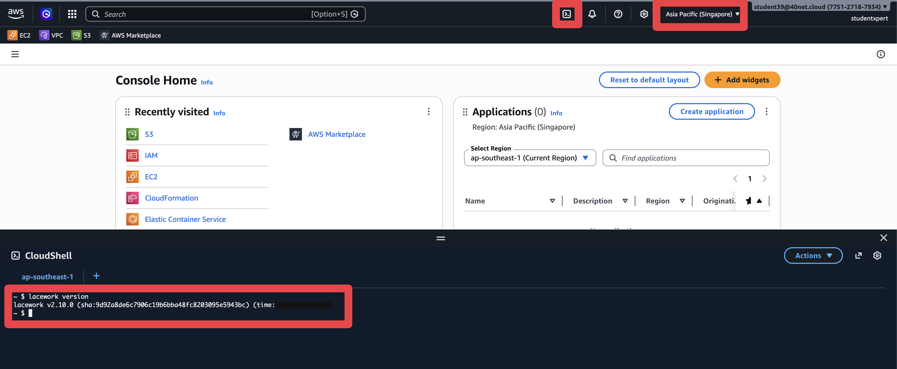

# Lab 8: Code Security for Applications (SCA)

## Objectives

Lab 7 scanned the code that builds your infrastructure. This lab scans the application that
runs on it, and it asks a different question: **what did you inherit?**

Modern applications are mostly other people's code. A team writes a few thousand lines and
imports a few hundred thousand. Software Composition Analysis reads what you pulled in and
tells you which of it is vulnerable, which of it carries a licence you cannot live with,
and whether anyone has committed a credential by accident.

You will also produce an **SBOM**, a parts list for your application. When the next
Log4j-scale vulnerability lands, the only question anyone asks is "are we affected?" An
SBOM turns that from a week of archaeology into a search.

## Prerequisites

- Completed [Lab 6](../lab-06/README.md), with the CLI working in CloudShell

## Lab Steps

Still in CloudShell from Lab 7. If it timed out, reopen it and run `source ~/.bashrc`.

### Step 1: Install the SCA Scanner

```bash
lacework component install sca
```

Already installed? `lacework component update sca` instead.



### Step 2: Get Some Code to Scan

A JavaScript and TypeScript application, deliberately full of problems:

```bash
cd ~
git clone https://github.com/andrewbearsley/lacework-sca-scan-example.git
cd lacework-sca-scan-example
```

### Step 3: Scan It

```bash
lacework sca scan .
```

> **SCA does not upload by default. IaC does.** If you want the results sent to the
> platform, ask for it:
>
> ```bash
> lacework sca scan . --save-results=true
> ```
>
> That needs git metadata, which the cloned repo has.
>
> As in Lab 7, results still will not appear under **Risk Center** > **Findings** >
> **Code Security** > **Applications** until the repository is onboarded through
> **Code Security** > **Add integration**, or the scan runs in a registered CI/CD pipeline.

### Step 4: Read the Output

Four kinds of finding come back. They are worth telling apart, because different people fix
them:

| Finding | What it means | Who fixes it |
|---|---|---|
| **Vulnerabilities** | CVEs in packages you imported, direct or pulled in by something else | Usually a version bump |
| **Weaknesses** | CWEs in code that was written here: SQL injection, hard-coded credentials, weak auth | A developer, properly |
| **Secrets** | A credential committed to the repo | Rotate it first, then remove it |
| **Licences** | A dependency whose terms may not suit a commercial product | Legal, not engineering |

Work through the same three questions as Lab 7:

1. How many Critical and High vulnerabilities?
2. Are they in packages you chose, or in packages **those** packages chose? Transitive
   dependencies are the ones teams are surprised by.
3. Were any secrets found? That is the finding to act on today.

**Checkpoint:** you can say whether the worst vulnerability is in a direct or a transitive
dependency.

### Step 5: Generate an SBOM

```bash
lacework sca scan ./ -f cdx-json -o sbom.json
```

That writes CycloneDX JSON, one of the two formats regulators and customers ask for. Have a
look at how much is in there:

```bash
head -40 sbom.json
grep -c '"name"' sbom.json
```

**Checkpoint:** the count is far larger than the number of packages the application
directly imports. That gap is the point of the exercise.

## What did we do here?

We inventoried what the application actually contains, rather than what its authors wrote.

The vulnerability count matters less than the shape of it: most of the risk arrives through
dependencies nobody chose deliberately. That is why an SBOM is worth generating before you
need it. The day a Log4j-scale CVE is announced, the teams that can answer "are we affected"
in minutes are the ones that already had the parts list.

## Additional Resources

- <a href="https://docs.fortinet.com/document/lacework-forticnapp/latest/administration-guide/433465/software-composition-analysis-sca" target="_blank">Lacework SCA Scanning Documentation</a>
- <a href="https://github.com/andrewbearsley/lacework-sca-scan-example" target="_blank">Example Repository</a>


