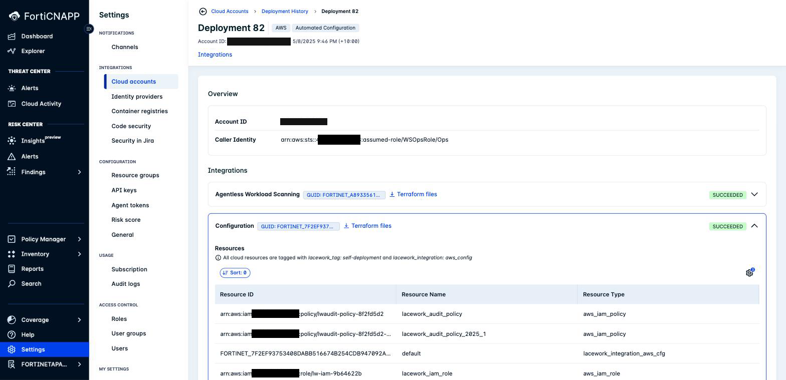
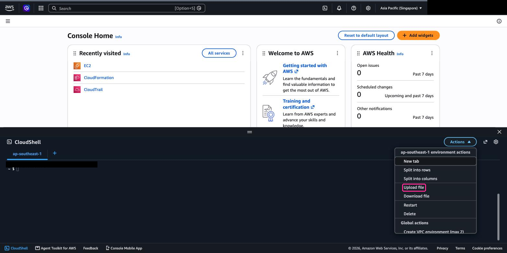
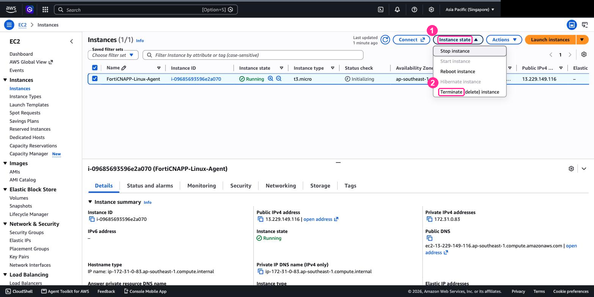
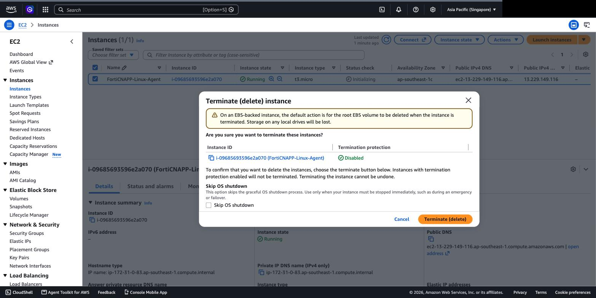

# Lab 10: Clean Up Workshop Resources

## Objectives

Leaving workshop resources running in AWS costs money. In this lab, we'll remove everything
the workshop created: the integrations from Labs 3 and 4, the resources they built in AWS,
the EC2 instances from Labs 5 and 6, and the API key from Lab 7.

**How you remove something depends on how it was made.** That is the real lesson here, and
it is why this lab has three routes rather than one.

| What made it | Route | Removes both sides? |
|---|---|---|
| **Lab 4, CloudFormation** | **A. Delete the stack** | **Yes.** The stack owns the integration record as well as the AWS resources |
| Lab 3, the wizard | **B. Console and tag search** | No. Two separate jobs, done by hand |
| Lab 3, the wizard, if you did Lab 11 | **C. Terraform destroy** | **Yes.** One command per integration |

Start with **Route A**, which clears Lab 4 in a single step. Then use **Route B** for what
Lab 3 built, or **Route C** if you have Terraform installed.

> [!IMPORTANT]
> **Do this before [Lab 12](../lab-12/README.md).** One AWS account carries one integration
> of each type per tenant, so Lab 12 cannot deploy CloudTrail as code while Lab 4's
> CloudTrail is still registered.

---

## Prerequisites

- Access to the AWS Console
- FortiCNAPP console access, tenant **FORTINETAPACDEMO**

## First, find what was created

Whichever route you take, start here.

1. Go to **Settings** > **Integrations** > **Cloud accounts**.
2. Select the **Deployment History** tab.
3. Open the deployment you created in Lab 3.
4. Expand each integration to see its **Resources** table.



Each integration lists every resource by ARN, name and type, and states the exact tags
applied, for example:

> All cloud resources are tagged with `lacework_tag: self-deployment` and
> `lacework_integration: aws_config`

> [!WARNING]
> **Read the tag values from this screen, and search on the tag key.** The values are not
> stable. The administration guide documents `lacework_tag: self-deployment` and
> `lacework_integration: configuration`. A 2026 deployment record shows
> `lacework_integration: aws_config`. Resources deployed in March 2025 carry
> `lacework_tag: lacework-self-deploy`. All of these are real, seen in the same tenant.
> The console and the AWS tag can even disagree on the same deployment: one September 2026
> run showed `aws_agentless` on the deployment record and `agentless` on the resources.
>
> Search on the key `lacework_tag` with any value. Filter on a value and you will miss
> resources and leave them running.

Keep this page open. It is your checklist either way.

---

## Route A: Delete the CloudFormation Stack

This removes everything Lab 4 created, on both sides, in one operation.

1. In the AWS Console, go to **CloudFormation** > **Stacks**.
2. **Check the region selector** matches where you created the stack, `ap-southeast-1`.
   A stack is only visible in its own region.
3. Select **forticnapp-cloudtrail**.
4. Click **Delete stack**.
5. Type the stack name to confirm, then click **Delete stack**.

Deletion takes a minute or two. Wait for the stack to leave the list.

**Checkpoint:** in FortiCNAPP, **Settings** > **Integrations** > **Cloud accounts** no
longer lists a CloudTrail integration for this account. You did not delete it there. The
stack deregistered it on the way out, through the same callback that registered it in
Lab 4.

In AWS, the trail is gone too:

```bash
aws cloudtrail describe-trails --region ap-southeast-1 \
  --query "trailList[].[Name,IsOrganizationTrail]" --output text
```

Only the organization trails remain, the ones you never owned.

> **This is not how CloudFormation always behaves with FortiCNAPP.** Where an integration
> is created in the console first and CloudFormation only builds the AWS side, the stack
> does not own the record, and deleting the stack leaves the integration behind polling a
> bucket that no longer exists. Lab 4's template registers the integration itself, which is
> why it can also remove it. Check which pattern you have before assuming a stack delete is
> enough.

---

## Route B: Console and tag search

No tooling required. Deleting the integration does not touch AWS, so you clean up both
sides by hand.

### Step 1: Delete the Integrations in FortiCNAPP

1. Go to **Settings** > **Integrations** > **Cloud accounts**.
2. Select the **Cloud Accounts** tab.
3. Find your AWS account ID in the list.
4. Delete each integration on that account: Configuration, CloudTrail and Agentless.

### Step 2: Delete the AWS Resources by Tag

1. Log into the AWS Console.
2. Select the region you used in Lab 3.
3. Go to **Resource Groups & Tag Editor** > **Tag Editor**.
4. Set **Regions** to your workshop region, or **All regions** to be thorough.
5. Set **Resource types** to **All supported resource types**.
6. Add this tag filter:
   - **Tag key**: `lacework_tag`
   - **Tag value**: leave empty, so the search matches every value
7. Click **Search resources**.

Work through the result and delete each resource, cross-checking the deployment record.
Expect IAM roles and policies, S3 buckets, KMS keys, SNS topics, SQS queues, a CloudTrail
trail, an ECS cluster and Lambda functions.

Agentless scanning also tags its networking `LWTAG_LACEWORK_AGENTLESS`, which the
`lacework_tag` search does **not** return. Run a second search on that key to catch the
VPC, subnet, route table, internet gateway and security group in every scanned region.

**Checkpoint:** both tag searches come back empty, or return only the resources listed
under "a tag search will still return a few resources" at the end of this lab.

> [!IMPORTANT]
> **Order matters.** Empty an S3 bucket before deleting it. Delete resources that depend on
> an IAM role before the role. A KMS key can only be scheduled for deletion, minimum seven
> days.

---

## Route C: Terraform destroy

Better. The only route that removes both sides at once. The bundle FortiCNAPP gives you
contains **full Terraform state**, including the FortiCNAPP integration itself, so
`terraform destroy` deregisters the integration and deletes the AWS resources in one pass.

You need Terraform. CloudShell does not ship it, so complete [Lab 11](../lab-11/README.md)
first, or install it now.

### Step 1: Download the Terraform bundle

On the deployment record, click **Terraform files** next to an integration. Repeat for each
integration; **the bundle is per integration**, so three integrations means three bundles.

> **You cannot `curl` this URL.** It is authenticated by your browser session, not by an
> API token. Fetching it without a browser returns `401` and an HTML login page. Download
> it in the browser, then upload it to CloudShell.

### Step 2: Upload it to CloudShell

1. Open CloudShell.
2. Choose **Actions** > **Upload file**.



3. Select the `tf-files.tar.gz` you just downloaded.

### Step 3: Destroy

Get fresh credentials the same way you did in [Lab 2](../lab-02/README.md), then:

```bash
mkdir -p ct && tar -xzf tf-files.tar.gz -C ct && cd ct

terraform init

terraform plan -destroy \
  -var access_key="$AK" -var secret_key="$SK" -var token="$ST"

terraform destroy \
  -var access_key="$AK" -var secret_key="$SK" -var token="$ST"
```

Read the plan before you apply it. It should list the AWS resources **and** a
`lacework_integration_*` resource. That last one is the integration record. It is why this
route cannot leave an orphan.

**Checkpoint:** `terraform destroy` ends with `Destroy complete!` and a resource count.

Repeat for each bundle. A full three-integration teardown took about four minutes in
testing, most of it the agentless VPC and ECS cluster. Terraform prints `Still
destroying...` every ten seconds, so it is working, not stuck.

For reference, a full run on one account destroyed:

| Bundle | Resources |
|---|---|
| Agentless | 41 |
| CloudTrail | 29 |
| Configuration | 19 |

---

## Remove the CLI credential

Both routes need this. [Lab 7](../lab-07/README.md) put a downloaded **API key** onto your
CloudShell home directory. Nothing above removes it.

CloudShell keeps your home directory for 120 days, so the key outlives the workshop.

In CloudShell:

```bash
rm -f ~/.lacework.toml
rm -f ~/*-api-key.json          # the file you downloaded in Lab 7
rm -rf ~/bin/lacework ~/.config/lacework
```

Check the second line matches before you run it. `rm ~/*.json` would take anything else you
had in there.

> [!CAUTION]
> **Do not delete the `AWS Lab` service user or its key.** You did not create it. Lab 7
> had you download a key that already existed and is shared by everyone in the room.
> Deleting it revokes it for every other student at the same time.
>
> Only delete a key in the console if **you** created it. If you are unsure, you did not.
>
> The key is shared because **FortiCNAPP caps how many API keys a tenant can hold**. One
> key for the room is a deliberate choice, not an oversight, and it cannot be replaced with
> one key per student.

Removing the local copies above is the part that matters to you. The key is shared, so the
risk you control is the copy sitting in your own CloudShell home directory, which survives
for 120 days.

> A leaked API key is worth more to an attacker than any resource in this lab. It reads the
> whole tenant. Treat deleting your local copies as mandatory, not optional tidying.

## Terminate the EC2 Instances

Both routes need this. The agents in Labs 5 and 6 run on instances the integrations do not
own.

> [!WARNING]
> **Check every region you have opened today, not just the workshop one.** The console
> opens in whatever region you last used, and past runs of this workshop have left
> instances running in Ireland and the US because nobody changed the selector before
> launching. Those keep billing.
>
> The quickest way to be sure, from CloudShell:
>
> ```bash
> for r in $(aws ec2 describe-regions --query 'Regions[].RegionName' --output text); do
>   ids=$(aws ec2 describe-instances --region "$r" \
>     --filters Name=instance-state-name,Values=running,stopped \
>     --query 'Reservations[].Instances[].InstanceId' --output text)
>   [ -n "$ids" ] && echo "$r: $ids"
> done
> ```

1. Go to the **EC2** service.
2. Find the instance from Lab 5, for example `FortiCNAPP-Linux-Agent`.
3. Tick its checkbox, then **Instance state** > **Terminate (delete) instance**.



4. Confirm in the dialog. The root EBS volume goes with the instance, so there is no
   separate volume to clean up afterwards.



5. Repeat for the Lab 6 Windows instance.

## Verify

1. In FortiCNAPP, confirm your AWS account no longer appears under **Cloud accounts**.
2. In FortiCNAPP, confirm the Lab 7 API key is gone from **Settings** > **Configuration** > **API keys**.
3. Confirm both EC2 instances show **terminated**.
4. In AWS, check that nothing is still running:

```bash
aws cloudtrail describe-trails --query "trailList[].Name" --output text
aws ecs list-clusters --query clusterArns --output text
aws events list-rules --query "Rules[?contains(Name,'lacework')].[Name,State]" --output text
aws s3api list-buckets --query "Buckets[?contains(Name,'lacework')].Name" --output text
```

All four should come back empty. The EventBridge one matters most, because that is the
hourly trigger.

### A tag search will still return a few resources, and that is normal

Re-run the Tag Editor search and you will still see a dozen or so entries, plus the IAM
policies in the global index. Check their state before chasing them:

| Resource | Expected state after cleanup |
|---|---|
| KMS key | `PendingDeletion`, scheduled 7 to 30 days out. AWS does not delete keys immediately. |
| Secrets Manager secret | Deleted, inside its recovery window |
| ECS cluster | `INACTIVE` |
| ECS task definition | `INACTIVE`. Deregistered task definitions stay in the account permanently. |
| IAM roles and policies | Still there. Nothing in this lab deletes IAM. |
| Security group, subnet, route table, VPC | Gone once the agentless stack is removed. The tag index lags behind by minutes. |

```bash
aws kms describe-key --key-id <key-id> --query 'KeyMetadata.[KeyState,DeletionDate]' --output text
aws ecs describe-clusters --clusters <name> --query 'clusters[0].status' --output text
aws events describe-rule --name <rule-name> --query 'State' --output text
```

> [!WARNING]
> **Two of these tell you the cleanup did not finish.** An ECS cluster reading `ACTIVE`,
> or an EventBridge rule reading `ENABLED`, means the agentless scanner is still scheduled.
> That is the one thing on this page worth acting on straight away. Everything else is
> inert.

Nothing else here is running or scanning. The one to watch on cost is the KMS key, which
carries a small monthly charge until its deletion date passes.

## Why this lab matters more than it looks

Orphaned agentless infrastructure keeps running.

The agentless scanner is driven by an **EventBridge rule on an hourly schedule**. Deleting
the integration in FortiCNAPP does not delete that rule. It keeps firing, keeps starting an
ECS task, and keeps costing money, while reporting to an integration that no longer exists.

We found exactly this in a real Fortinet demo account: an agentless deployment from March
2025 still running `rate(1 hour)` in September 2026, pointing at an integration GUID that
had been deleted from the tenant. Nothing in the FortiCNAPP console showed it, because there
was no integration left to show.

Orphaned storage grows quietly too. The CloudTrail bucket left behind by that same
deployment held **816,721 objects** by the time we emptied it, eighteen months of logs
nobody was reading.

Check the EventBridge rule in every region you scanned:

```bash
aws events list-rules --region <region> \
  --query "Rules[?contains(Name,'lacework')].[Name,State,ScheduleExpression]" --output text
```

## What did we do here?

We took it all down, both sides, and that turned out to be the harder half.

**Deleting an integration in the console does not delete anything in AWS.** It removes the
record. The roles, buckets, queues and scheduled triggers carry on without it. We found an
agentless deployment in a Fortinet account still firing every hour eighteen months after
its integration was deleted, with over 800,000 objects in its CloudTrail bucket.

Each route answers that gap differently:

| Route | Who owns what | Result |
|---|---|---|
| **A, delete the stack** | The CloudFormation stack owns the AWS resources **and** the integration record | One operation, nothing left behind |
| **B, console and tag search** | FortiCNAPP owns the record, AWS owns the resources, nothing spans both | Two jobs by hand, and the gap orphans fall through |
| **C, terraform destroy** | The state file spans both | One command per integration |

Route B is where you can see the seam, which is why it is worth doing once even though it
is the slowest. Routes A and C both work because something owns both sides at once.

**When you onboard an account, agree the teardown at the same time.** It is a much easier
conversation before anything is deployed than after somebody finds the bill.

---

That is the core path finished.

Still curious? The optional track onboards the same account as code instead of through the
wizard: [Lab 11: Install Terraform](../lab-11/README.md).
