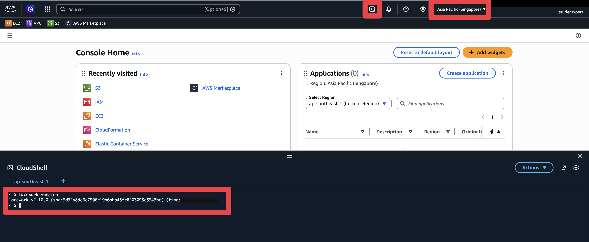

# Lab 12: Install Integrations via Terraform

## Objectives

You have now onboarded this account twice, by two different methods. Lab 3 used the console wizard. Lab 4 used a CloudFormation template. [Lab 10](../lab-10/README.md) then removed both.

This lab does it a third way, and it is the one most teams end up standardising on: **Terraform**. We'll use the Lacework CLI to generate the code, read it, then apply it.

The difference is not the result, it is what you are left holding. A wizard leaves you with a working integration. Terraform leaves you with a working integration **and a file you can review in a pull request, commit, and apply again next quarter to a different account**. That is why the same integration is worth building a third time.

Like CloudFormation in Lab 4, Terraform talks to the FortiCNAPP API directly, so the organization trail on your account is not a factor here either.

## Prerequisites

- Completed [Lab 11: Install Terraform](../lab-11/README.md)

> [!TIP]
> **Shortcut worth knowing.** If you already onboarded with automated configuration in
> Lab 3, you can download the Terraform FortiCNAPP generated instead of generating your
> own. Go to **Settings** > **Integrations** > **Cloud accounts** > **Deployment History**,
> open your deployment, and click **Terraform files** on any integration. This lab
> generates the code from scratch so you can see how the Lacework CLI does it.
- AWS account with appropriate permissions
- FortiCNAPP account access with API key configured

## Lab steps

### Step 1: Open AWS CloudShell

1. Navigate to <a href="https://aws.amazon.com/" target="_blank">https://aws.amazon.com/</a>
2. Click **Sign into console**
3. After logging in, change to your local region (e.g., **Asia Pacific (Singapore)**) using the region selector in the top right of the AWS Console
4. Click the **CloudShell** icon in the top navigation bar (cloud icon with `>_` symbol)
5. Wait for CloudShell to initialize

### Step 2: Verify Lacework CLI Configuration

Verify that the Lacework CLI is configured and working:

```bash
lacework version
```



### Step 3: Generate Terraform Configuration for AWS Integration

Use the Lacework CLI to generate Terraform code for the CloudTrail integration:

```bash
lacework generate cloud-account aws \
  --cloudtrail --noninteractive \
  --aws_region ap-southeast-1
```

> [!IMPORTANT]
> **Do not add `--config` here**, and only run this after [Lab 10](../lab-10/README.md)
> has cleaned up.
>
> One AWS account can carry one integration of each type per tenant. If Lab 3's
> Configuration or Lab 4's CloudTrail is still in place, Terraform builds around 18 AWS
> resources, has the registration call rejected with *"The provided aws account is already
> used in this Lacework Application"*, and then destroys them all again. Nothing is left
> behind, but you wait through the whole cycle to learn something that was knowable up
> front.

**Parameters explained:**
- `--cloudtrail`: Enable AWS CloudTrail integration
- `--noninteractive`: Run without prompts (uses defaults)
- `--aws_region ap-southeast-1`: Specify the AWS region (Asia Pacific - Singapore)

This command generates Terraform files in the `~/lacework/aws` directory.

### Step 4: Review Generated Terraform Files

Navigate to the generated Terraform directory and review the files:

```bash
cd ~/lacework/aws
ls -la
```

The CLI generates a single `main.tf` file that uses pre-built Terraform modules from the Lacework registry. All the complexity (IAM policies, S3 buckets, CloudTrail setup) is handled by the modules with sensible defaults.

Review the generated configuration:

```bash
cat main.tf
```

### Step 5: Initialize Terraform

CloudShell home is capped at 1 GB and the AWS provider alone is ~700 MB, so with the Lacework CLI (~50 MB) and Terraform binary (~150 MB) already in `~/bin`, there's barely enough room. CloudShell's split mount layout (`/home` on disk, `/tmp` on tmpfs) also trips up git when Terraform downloads modules. Set three env vars to work around both before running `init`:

```bash
mkdir -p /tmp/tfcache $HOME/tmp
export TF_PLUGIN_CACHE_DIR=/tmp/tfcache
export TMPDIR=$HOME/tmp
export GIT_DISCOVERY_ACROSS_FILESYSTEM=1
terraform init
```

What each one does:
- `TF_PLUGIN_CACHE_DIR=/tmp/tfcache` puts the provider cache on tmpfs (several GB) instead of home (1 GB).
- `TMPDIR=$HOME/tmp` keeps git's temp working dir on the same filesystem as `.terraform/modules/`, so module clones don't fail crossing the `/home` mount boundary.
- `GIT_DISCOVERY_ACROSS_FILESYSTEM=1` silences git's mount-crossing complaint if it does happen.

> **Troubleshooting**
>
> - `Error while installing ... it is still not detected in /tmp; this is a bug in Terraform`: CloudShell home is full (the "/tmp" message is misleading). Run `df -h $HOME` to confirm, then `rm -rf ~/lacework/aws/.terraform ~/lacework/aws/.terraform.lock.hcl /tmp/tfcache` and retry.
> - `Error while installing ...: text file busy`: a stale terraform process is holding the provider binary open. Run `pkill -f terraform`, then `rm -rf /tmp/tfcache` and retry.
> - `Could not download module ...: not a git repository (or any parent up to mount point /home)`: the env vars above (`TMPDIR` and `GIT_DISCOVERY_ACROSS_FILESYSTEM`) fix this. Make sure both are exported in the same shell as `terraform init`.

### Step 6: Review Terraform Plan

Review what Terraform will create before applying:

```bash
terraform plan
```

This shows you:
- Resources that will be created (IAM roles, CloudTrail, S3 buckets, etc.)
- Any changes that will be made
- Output values that will be generated

The plan output will display in your terminal. Review it carefully to understand what will be deployed.

**What will be created (29 resources):**

**AWS CloudTrail Integration:**
- 1 CloudTrail - AWS CloudTrail for API activity logging
- 2 S3 Buckets - One for CloudTrail logs, one for CloudTrail log delivery
- 2 S3 Bucket Policies - Access policies for the buckets
- 2 S3 Bucket Versioning - Enable versioning on both buckets
- 2 S3 Bucket Encryption - Server-side encryption configuration
- 2 S3 Bucket Public Access Block - Block public access to buckets
- 2 S3 Bucket Ownership Controls - Bucket ownership settings
- 1 S3 Bucket Logging - Access logging configuration
- 1 S3 Bucket ACL - Access control list for log bucket
- 1 KMS Key - Encryption key for CloudTrail logs
- 1 SNS Topic - Topic for CloudTrail notifications
- 1 SNS Topic Policy - Access policy for SNS topic
- 1 SNS Topic Subscription - Subscription to forward notifications
- 1 SQS Queue - Queue to receive CloudTrail notifications
- 1 SQS Queue Policy - Access policy for SQS queue
- 1 IAM Policy - Cross-account policy for CloudTrail access
- 1 IAM Role Policy Attachment - Attaching policy to IAM role
- 1 Lacework Integration (`lacework_integration_aws_ct`) - CloudTrail integration
- 1 IAM Role - Cross-account role for FortiCNAPP to read the trail
- 1 Lacework External ID - Security identifier for the IAM role
- 2 Random IDs - Unique identifiers for resource naming
- 1 Time Sleep - Wait period for resource propagation

> No Configuration or Agentless resources appear in this plan, and none should. Lab 10
> removed everything Labs 3 and 4 built. This plan creates CloudTrail and nothing else.
>
> After this applies the account carries one integration, `AwsCtSqs`. Check
> **Settings** > **Integrations** > **Cloud accounts** before applying if you want to
> confirm you are starting from empty.

**Optional: Save the plan to a file:**

If you want to save the plan output for later review or documentation:

```bash
terraform plan > plan-output.txt
```

Then view it with:

```bash
cat plan-output.txt
```

### Step 7: Apply Terraform Configuration

If the plan looks correct, apply the Terraform configuration to deploy the integration:

```bash
terraform apply
```

When prompted, type `yes` to confirm the deployment.

**Note**: This takes two to three minutes. It ends with
`Apply complete! Resources: 29 added, 0 changed, 0 destroyed.` and creates:
- An IAM role and policy for the CloudTrail integration
- CloudTrail with encryption and logging
- Two S3 buckets, one for the trail and one for its access logs, both with versioning,
  encryption and public access blocked
- A KMS key for encryption
- An SNS topic and SQS queue for CloudTrail notifications
- One Lacework integration, `lacework_integration_aws_ct`
- Supporting resources: random IDs, an external ID, and a time delay for propagation

### Step 8: Verify Integration Deployment

After the Terraform apply completes successfully, verify the integration:

1. **Using Lacework CLI:**
```bash
lacework cloud-account list
```

You should see one entry for this account:
- `AwsCtSqs` (CloudTrail integration), named **TF cloudtrail**

It reads `Pending` at first, not `Ok`. The integration exists before any log data has
arrived through the queue.

2. **In FortiCNAPP Console:**
   - Log into FortiCNAPP console at <a href="https://partner-demo.lacework.net/" target="_blank">https://partner-demo.lacework.net/</a>
   - Ensure tenant is set to **FORTINETAPACDEMO**
   - Navigate to **Settings** > **Integrations** > **Cloud accounts**
   - Verify that your AWS account appears with the CloudTrail integration

### Step 9: Clean Up Resources

After completing the lab, clean up the resources created by Terraform:

1. **Review what will be destroyed:**
```bash
terraform plan -destroy
```

This shows you what resources will be removed.

2. **Destroy the resources:**
```bash
terraform destroy
```

When prompted, type `yes` to confirm the destruction.

**Note**: This will:
- Remove the FortiCNAPP integrations from your AWS account
- Delete IAM roles and policies created by Terraform
- Remove S3 buckets created for CloudTrail (if created by Terraform)
- Remove SNS topics created for notifications (if created by Terraform)
- **Note**: If you're using an existing CloudTrail, it will not be deleted, only the integration will be removed

3. **Verify cleanup:**
```bash
lacework cloud-account list
```

The AWS integrations should no longer appear in the list.

4. **Clean up Terraform files:**
```bash
rm -rf ~/lacework/aws
```

## What did we do here?

We built the CloudTrail integration a third way, with Terraform we own rather than a console wizard or a template someone else launched. The Lacework CLI generated 25 lines of `main.tf`, and `terraform apply` turned that into 29 resources: an IAM role, S3 buckets, KMS encryption, SNS and SQS notifications, and the FortiCNAPP integration itself.

This is how you'd do it in production. The Terraform configuration can be checked into version control, reviewed in pull requests, and deployed through CI/CD pipelines. Need to integrate 50 AWS accounts? Fortinet provides organization-level Terraform modules that deploy across all accounts in your AWS Organization in one go. And when you're done, `terraform destroy` cleanly removes everything.


## Additional resources

- <a href="https://docs.fortinet.com/document/forticnapp/latest/administration-guide/283460/aws-integration-terraform-from-aws-cloudshell" target="_blank">FortiCNAPP Documentation: AWS Integration Terraform from AWS CloudShell</a>

---

Next: [Lab 13: Scripted Cleanup of All Workshop Resources](../lab-13/README.md).
