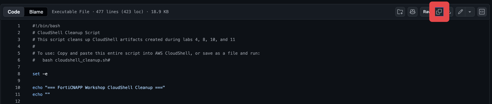

# Lab 13: Scripted Cleanup of All Workshop Resources

This lab provides a cleanup script that removes every workshop resource, on both the FortiCNAPP side and the AWS side.

> [!CAUTION]
> This script assumes a disposable workshop AWS account. It sweeps every enabled region and removes all EC2 instances, key pairs and non-default security groups in the account, not only the ones the workshop created, along with every FortiCNAPP integration pointing at that AWS account. Do not run it in an account that hosts anything you want to keep.

> [!CAUTION]
> **Run it in CloudShell, not on your own machine.** Step 5 clears the home directory it
> runs in. It deletes `~/.lacework.toml`, `~/.lacework`, `~/.terraform.d`, `~/bin/lacework`
> and any top-level folder whose name contains `Terraform`. In CloudShell that is exactly
> what you want. On a laptop it removes the Lacework CLI configuration you use for every
> other tenant.

> [!NOTE]
> **It does not touch IAM.** The roles in these accounts belong to whoever runs the account
> pool, and some of them drive cost management and automated cleanup. The workshop's own
> cross-account role is owned by a CloudFormation stack and goes when the stack does.


## Why both sides need cleaning

Who owns the integration record decides what a delete actually removes, and the three
methods in this workshop do not agree.

| Created by | Deleting the AWS side removes the FortiCNAPP record? |
|---|---|
| Lab 3, the wizard | No. The record is held in FortiCNAPP and nothing in AWS points back at it |
| Lab 4, CloudFormation | Yes. Its template registers the integration itself, through `LaceworkSnsCustomResource`, and deregisters it on delete |
| Lab 12, Terraform | Yes. Terraform holds the integration in state, so `terraform destroy` removes both sides |

Lab 3 is the case that strands. Remove its AWS resources and the integration stays,
polling on schedule, finding a bucket that no longer exists, and reporting:

```
Data loading error: Unable to access scan results within storage bucket
```

So the AWS sweep is not enough on its own. Any integration FortiCNAPP still owns has to be
deleted through FortiCNAPP, which is what Step 2 of the script does.

## Instructions

1. Open AWS CloudShell in your browser.

2. Copy the entire contents of [cloudshell_cleanup.sh](cloudshell_cleanup.sh) using the copy button.



3. Paste the script into the CloudShell terminal and press Enter.

4. Wait for the script to complete. It may take several minutes, especially when deleting CloudFormation stacks and S3 buckets. Sweeping every region adds time even when most regions are empty.

5. **Verify in the FortiCNAPP console.** Navigate to **Settings** > **Integrations** > **Cloud accounts** and confirm your AWS account is no longer listed. If anything remains, select it and click **Delete**.

## What the script does, in order

The order matters. The FortiCNAPP integrations are removed while the Lacework CLI and its credentials still exist, and the local CloudShell artifacts are only cleaned up at the very end.

| Step | Action |
|---|---|
| 1 | `terraform destroy` for the Lab 12 deployment, which removes its own integrations and AWS resources |
| 2 | Delete any remaining FortiCNAPP cloud integrations for this AWS account |
| 3 | Per region: terminate EC2 instances, delete CloudFormation stacks, delete CloudTrail trails, delete key pairs, delete non-default security groups |

> [!IMPORTANT]
> **Step 3 does not cover agentless scanner infrastructure.** It leaves the ECS cluster,
> its EventBridge schedule, the scanner VPC and the Secrets Manager secret in place. In the
> normal order that does not matter, because Lab 10 removed them before you got here. If
> you skipped Lab 10, check the two that keep costing you:
>
> ```bash
> aws ecs describe-clusters --clusters <cluster-name> --query 'clusters[0].status' --output text
> aws events describe-rule --name <rule-name> --query 'State' --output text
> ```
>
> `ACTIVE` and `ENABLED` mean the scanner is still scheduled. Go back to
> [Lab 10](../lab-10/README.md) and finish the tag sweep.
| 4 | Empty and delete Lacework-related S3 buckets, resolving each bucket's own region |
| 5 | Remove CloudShell artifacts: Terraform and Lacework binaries, cloned repos, config files, `.bashrc` edits |

## Notes

- The script runs non-interactively and disables the AWS CLI pager to prevent prompts.
- It continues past individual failures rather than aborting, so one stuck resource does not strand the rest of the cleanup.
- CloudFormation stack deletions wait for completion before proceeding.
- Stack matching is case-insensitive, handles names containing spaces, and deletes every matching root stack rather than just one. Lab 3 lets you name the stack freely, and a redeploy after a failed attempt leaves two.
- Nested stacks are skipped, since deleting the root stack removes them.
- S3 bucket deletion handles versioned objects and delete markers.
- The default security group is preserved.

## Troubleshooting

**An integration is still listed in FortiCNAPP after the script runs.**
The script needs the Lacework CLI (installed in Lab 7) and valid credentials to deregister integrations. If you skipped those labs, or the CLI could not authenticate, delete the integration manually: **Settings** > **Integrations** > **Cloud accounts** > select > **Delete**.

**A CloudFormation stack failed to delete.**
Usually a non-empty S3 bucket blocking it. The script retries while retaining the blocked resource, then Step 4 sweeps the bucket. Re-run the script once to clear the remainder.

**A security group would not delete.**
It is still attached to an instance that has not finished terminating. Wait a minute and re-run the script.

**Other failures.**
Check AWS permissions for the CloudShell user, and verify the resources exist before cleanup. Some resources need manual deletion if dependencies prevent automated removal.

---

That is everything. Back to the [workshop overview](../README.md).
